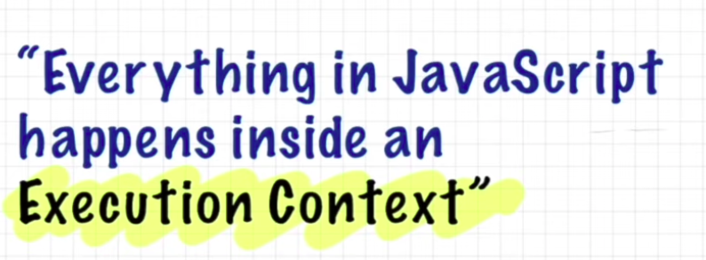
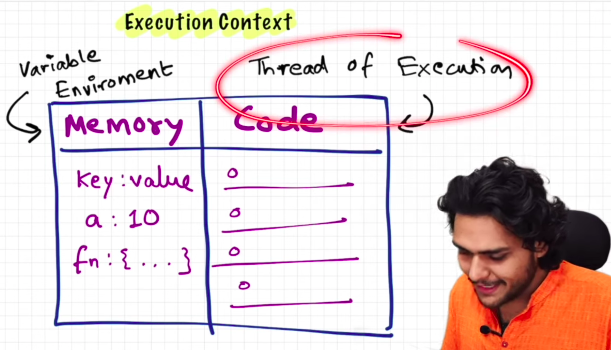
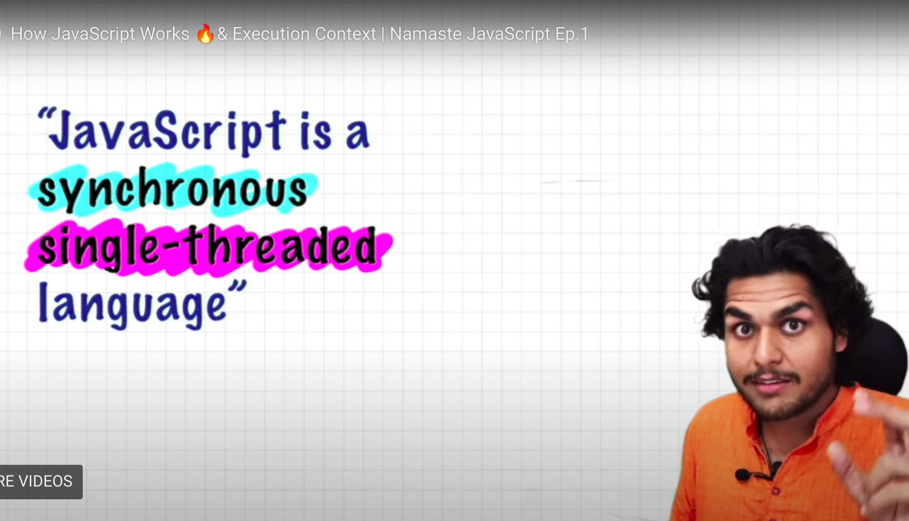

-----------

-----------

-----------

### Execution context has 2 parts:

- Memory component (Variable Environment)
  - Stores all the variables.
- Code component (Thread of Execution)
  - It's the part where the code execution happens.