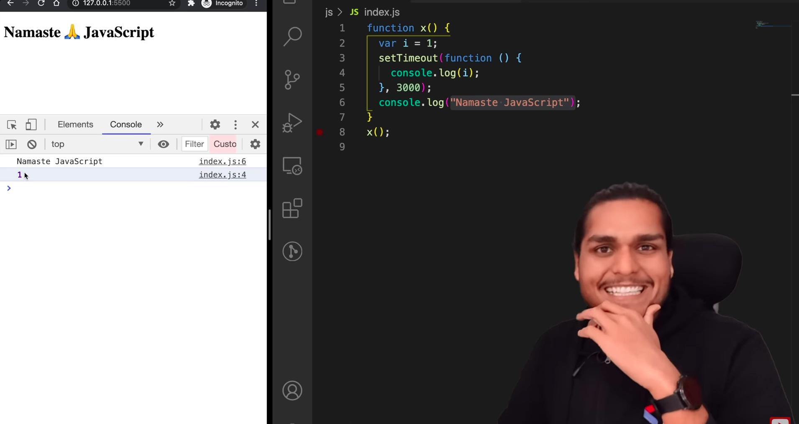
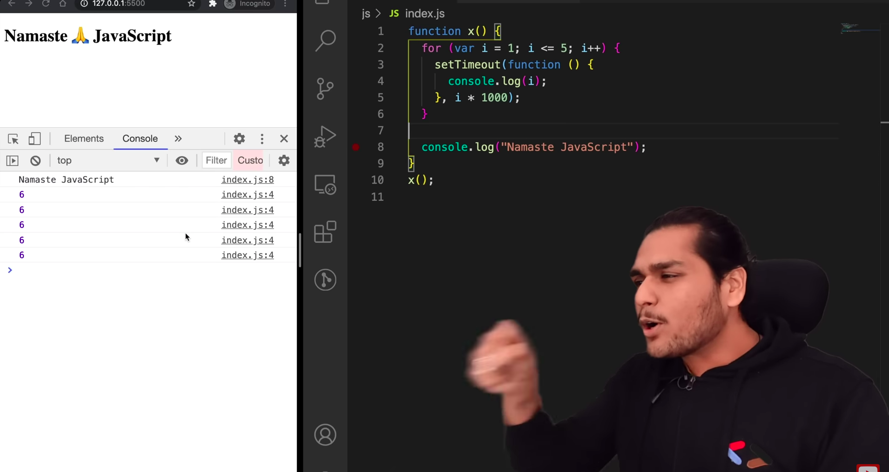
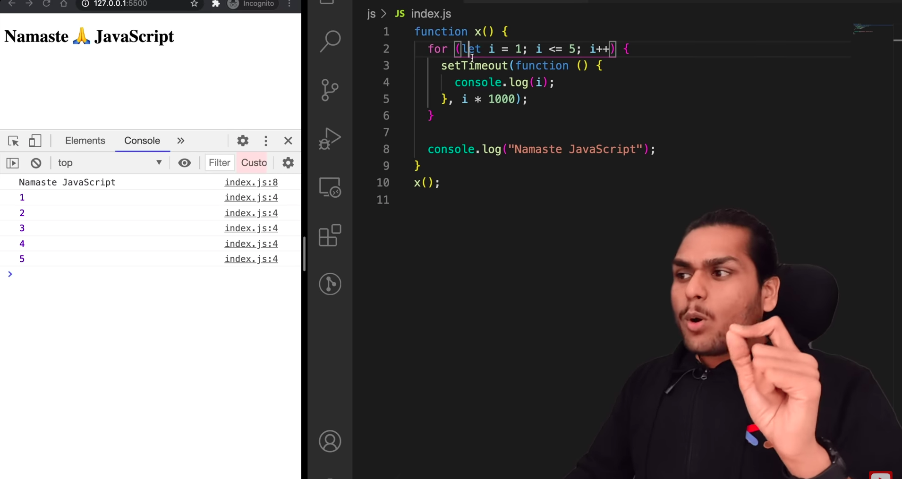
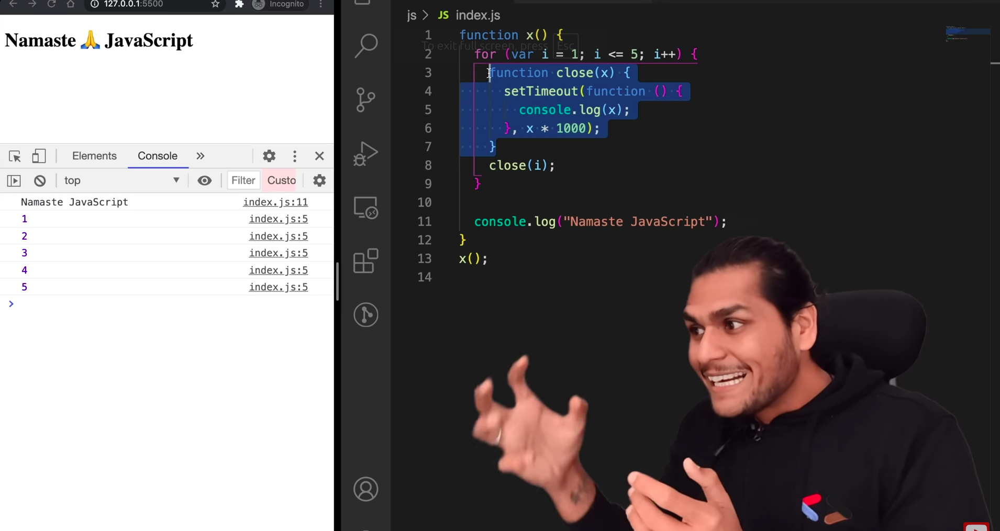

- JavaScript doesn't wait for 3 secs before console logging "Namaste JavaScript".
- setTimeOut takes the function (closure to be precise), attaches a timer to it. The rest of the JS code runs. But, once the timer expires, it gets the function back and executes it.

### Why is the output like this?

- setTimeOut takes the function (closure to be precise), attaches a timer to it. The function remembers the reference to variable i. Now, JS doesn't wait for anything. So, it runs the loop again and again. That's why it prints 6

### The fix

- The fix is to pass a new memory location each time in the loop.

- Since 'let' is block scoped, a new reference(memory location) is created everytime for each iteration in loop.

### The fix without let

  
- The fix is to pass a new memory location each time in the loop.
- It can be done like this.