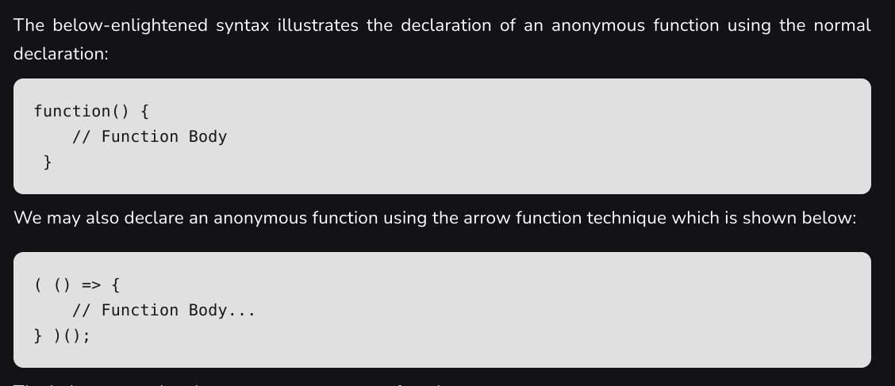
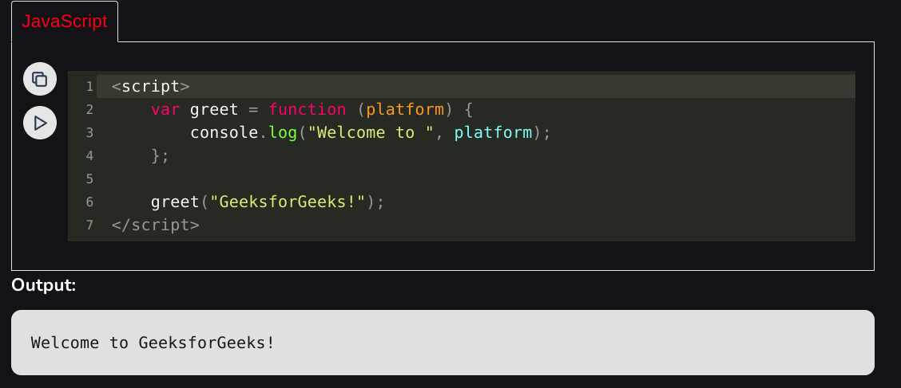
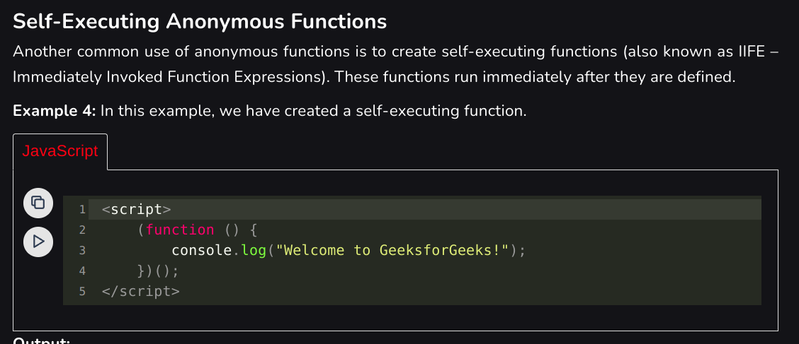
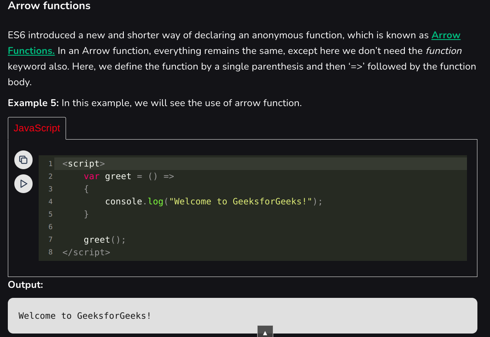
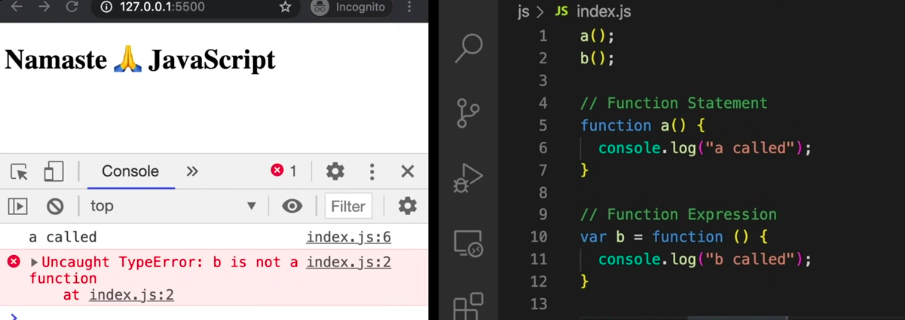
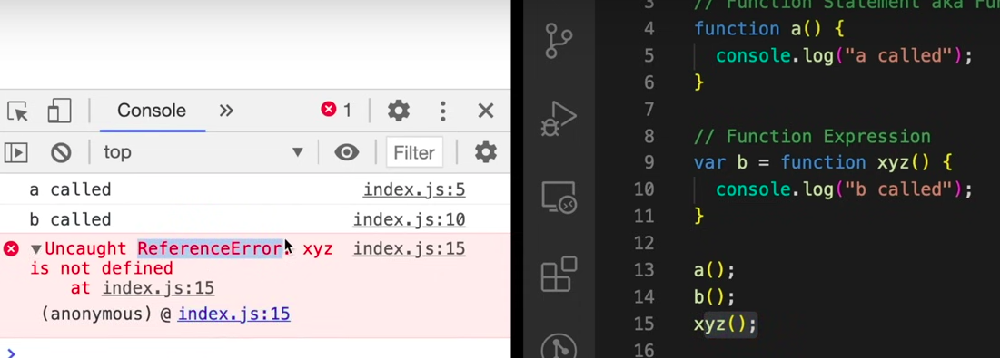
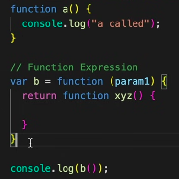

### Anonymous Functions
- Functions without name are called Anonymous Functions.

**Examples**

### Some important jargons

- The difference between function statement and function expression is hoisting.
- Function statement is also known as Function declaration.

- Functions which are assigned to variable but are named are called Named function expressions.

### First class Functions

- Functions that can pass functions as arguments or can return functions are called First class functions.

