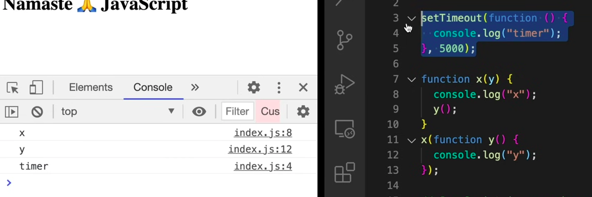
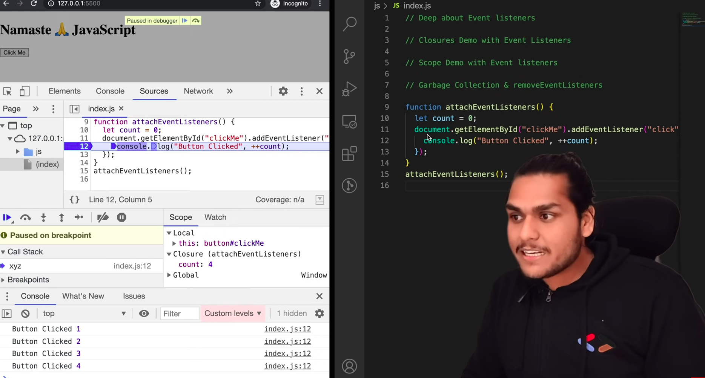

### Callback Functions

- Functions that are passed in another function as arguments are called Callback Functions.

- Blocking the main thread means, having a function which is blocking the call stack operations.

- Asynchronous operations are not possible without callback functions.

Functions in event listeners are callback functions.

### Closures with Callback Functions

- Event listeners are heavy. Because, event listeners have too keep track of so many variables of lexical scope.
- So, if there are so many event handlers on a page, the page becomes slow.