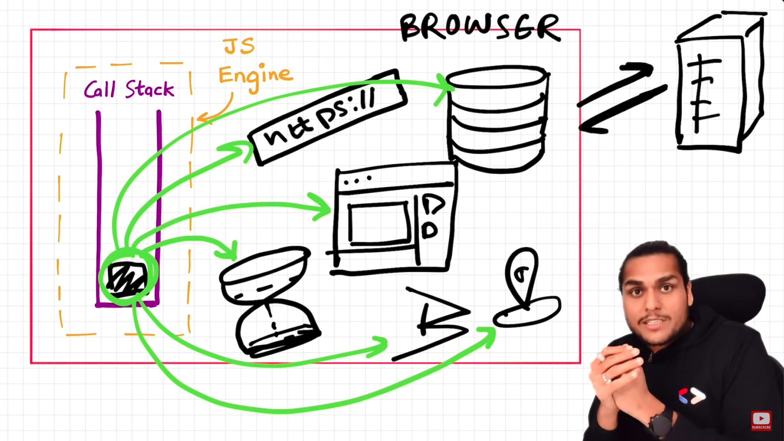
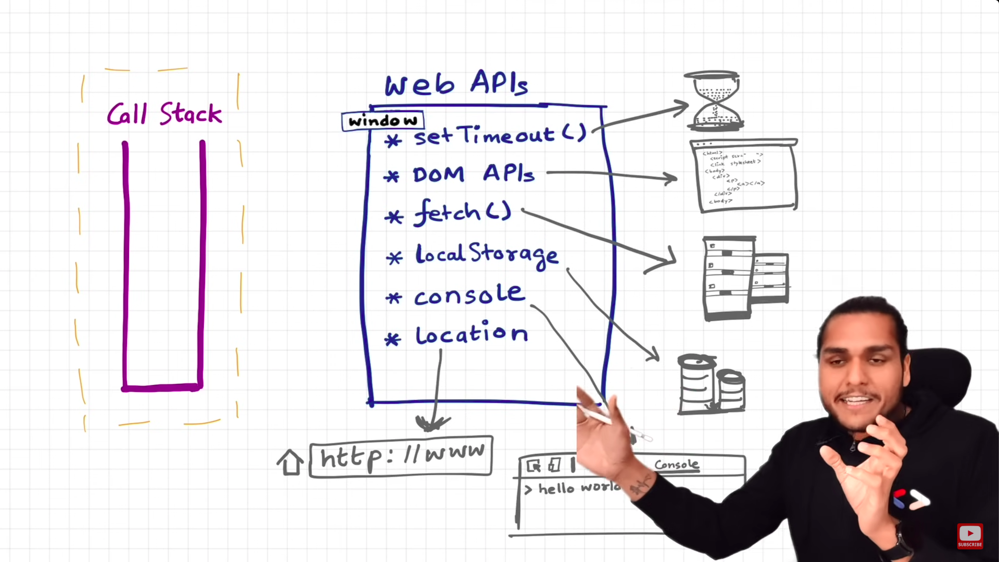
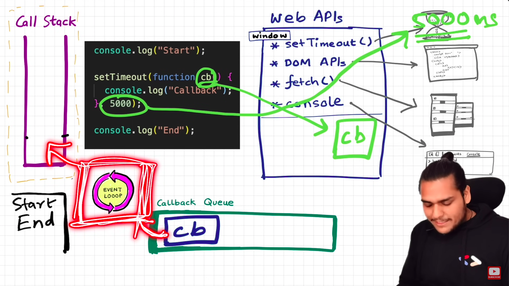
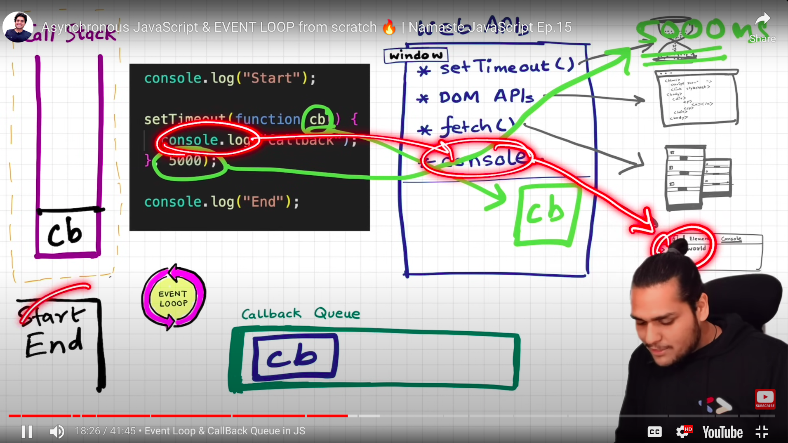
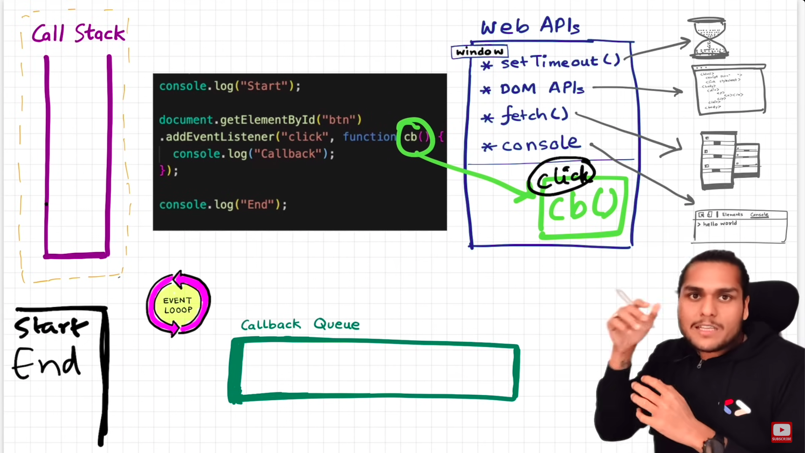
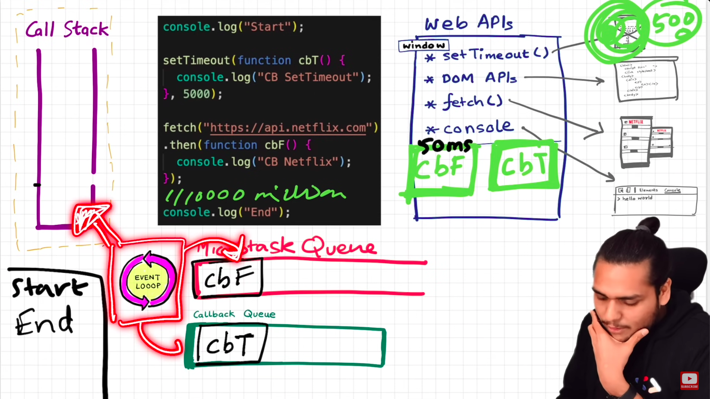
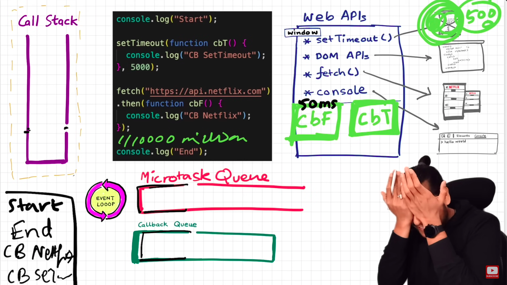

- Web APIs are not part of JavaScript. They are part of Browser.
- These APIs are provided to us by browser using the `window` keyword.
- So, `console.log("Hello)` is the same as `window.console.log("Hello)`

- **The job of Event loop is to monitor if the callstack is empty. If it is empty, get the items from callback queue and push it into call stack.**

- In the above image, the event listener is registered in the Web APIs while execution of Global Execution Context.
- When the button is clicked, the callback function is pushed into Callback queue and waits for its turn to be pushed into callstack.

### Why do we need a callback queue?

- Let's suppose the user clicks on the button multiple times. Event loop fetches them line by line from callback queue and places them into callstack.

### Fetch example

- MicoroTask Queue has more priority than CallBack Queue.
- All callback functions coming from promises are placed into MicroTask Queue.
- If Microtask queue task creates new microtasks, then the callback queue items will not be executed for a long time. This thing is called Starvation.
