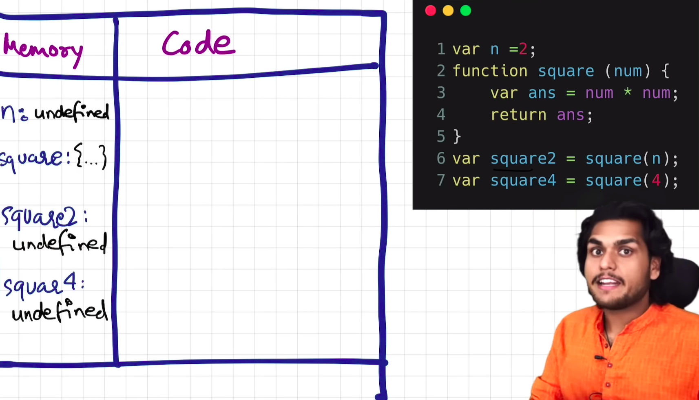
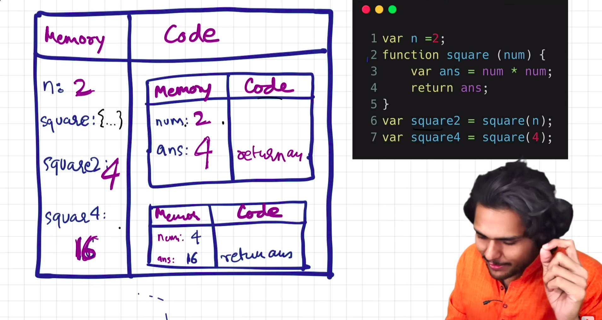
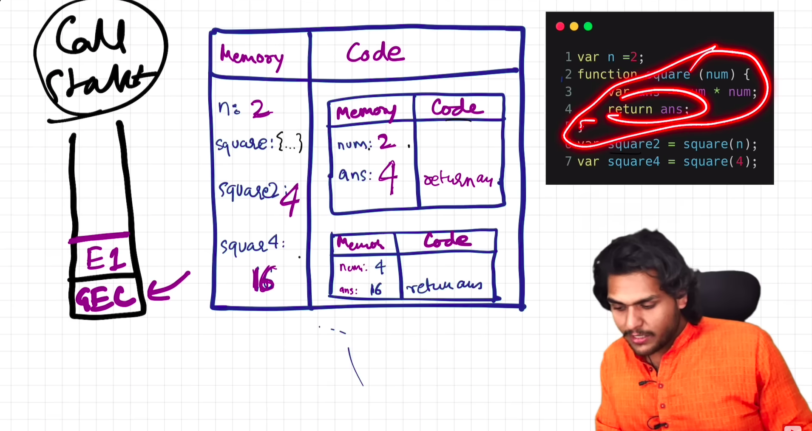
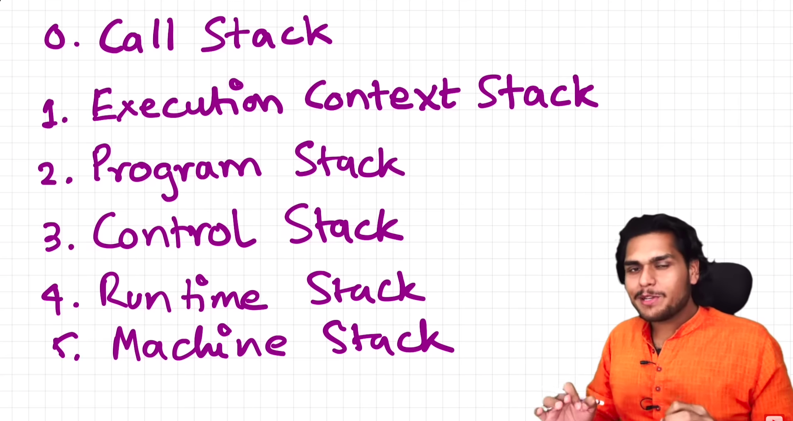

When JS code executes, it first creates a Global Execution Context.

### Phase 1: Memory Allocation Phase

In this phase,
- Memory is allocated to all the variables and functions.
- Variables are initialised with 'undefined'.
- Functions are initialised with 'the whole function code'.

### Phase 2: Code Execution Phase

In this phase,
- Code is run line by line.
- Values are assigned to variables.
- If a line contains function call, a new Execution context is created and pushed onto call stack which contains the parameters, local variables of function and functions inside that function and the two phases are run.
- When the line with return keyowrd is executed, function execution context is removed from stack.

### Call Stack

### Other names for Call Stack
