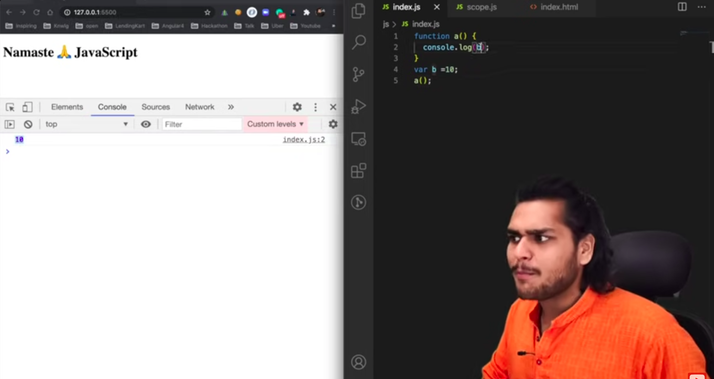
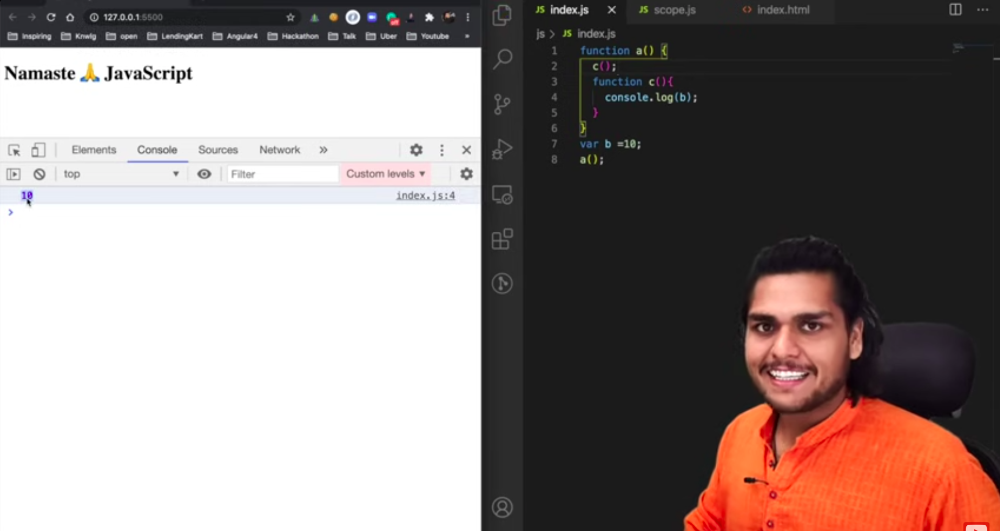
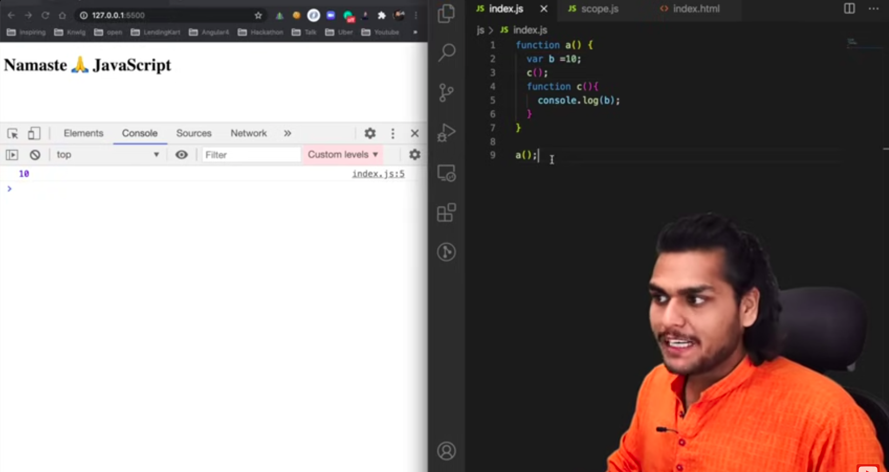
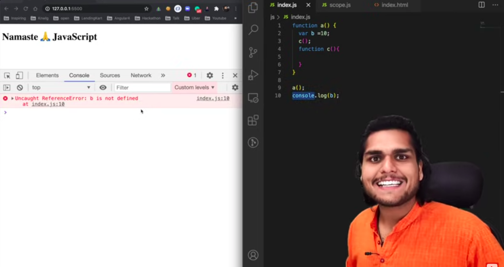
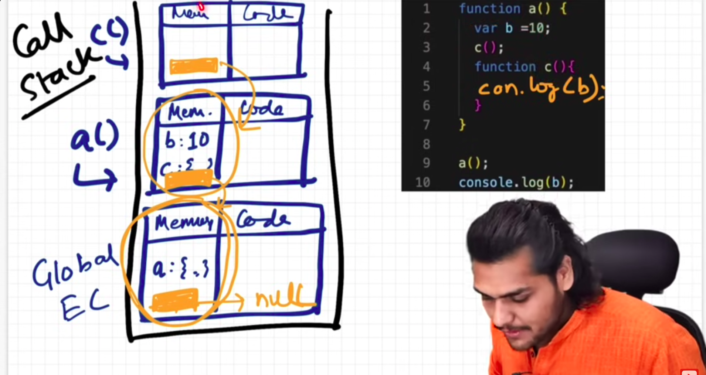

-------------------

---------------------

---------------------

---------------------

### Scope

Where can a variable be accessed is called as scope.

### Lexical Environment

- Lexical means "in heirarchy".
- Lexical env = Local memory + Lexical env of parent.
- Lexcal env of c() = Local memory of c() + lexecal env of a()
- That's why 5th line of function c() is able to access variable b of function a().

### Scope Chain

- This chain of Lexical Envoronments is called the Scope chain.