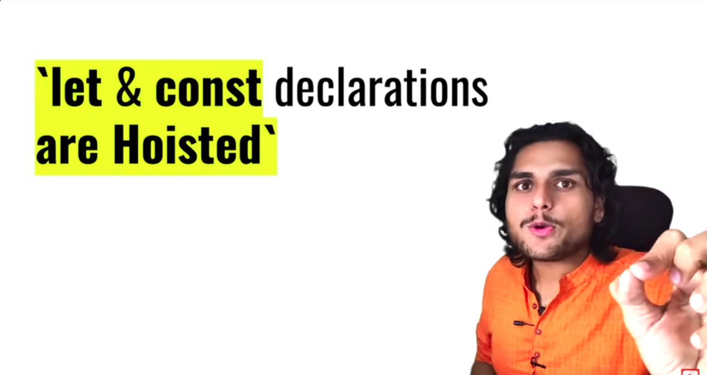
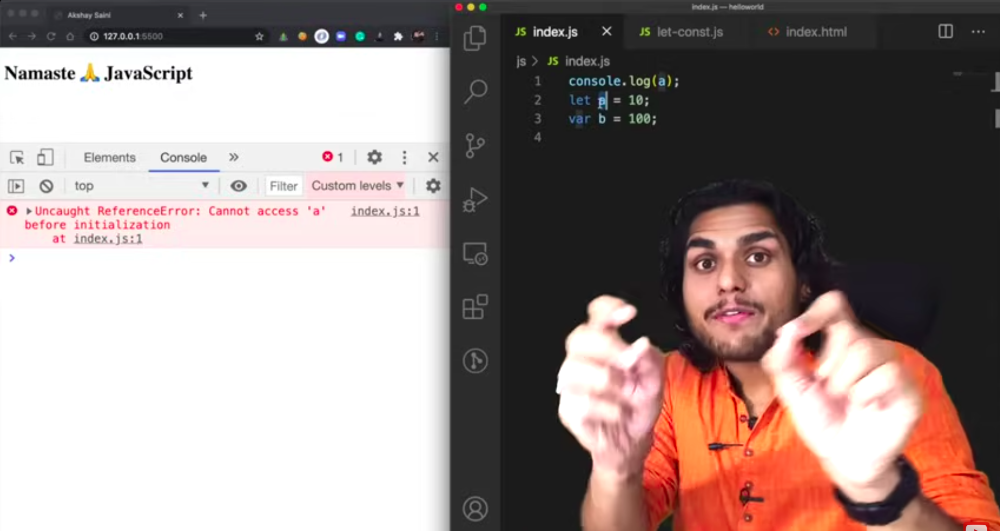
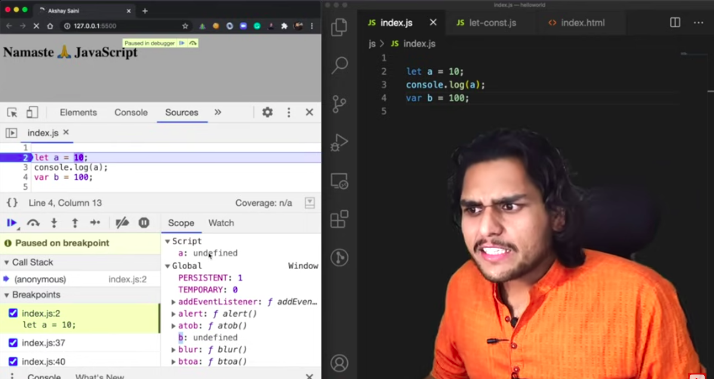
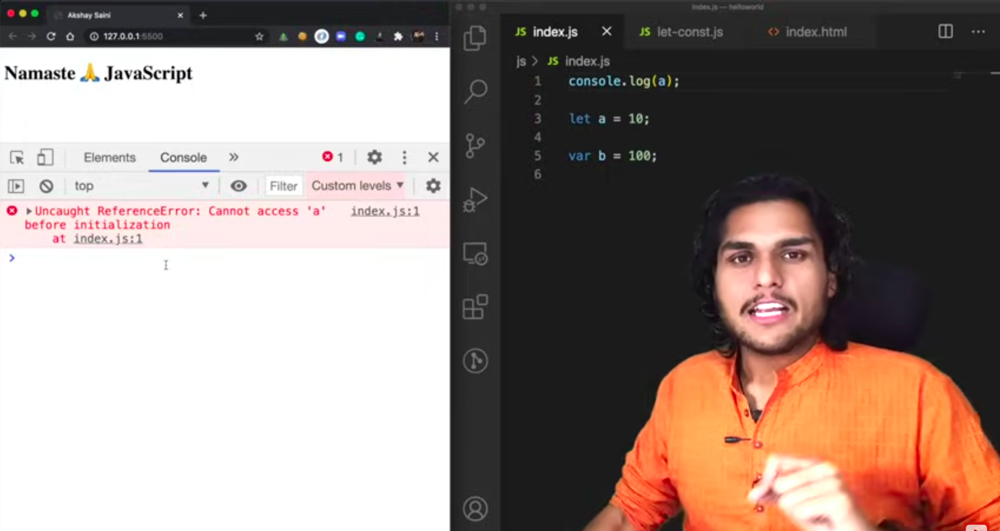
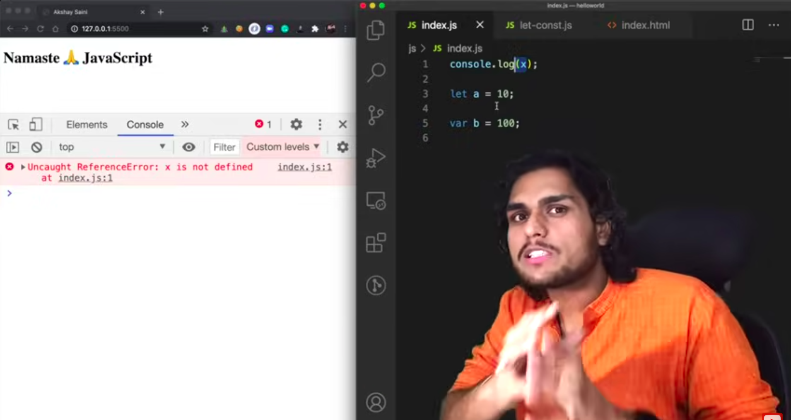
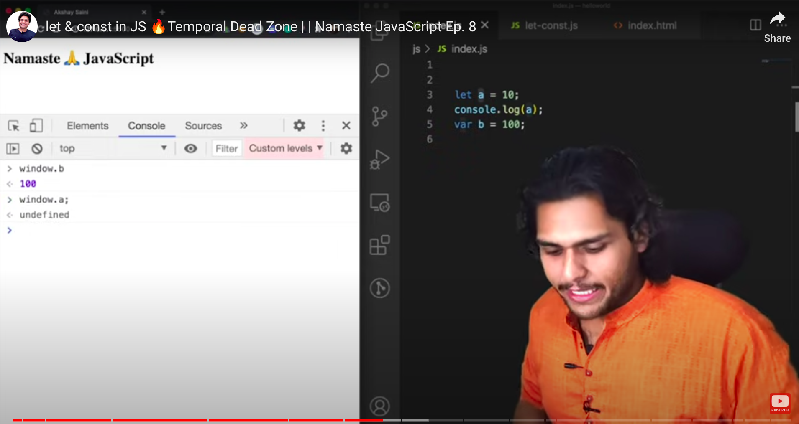
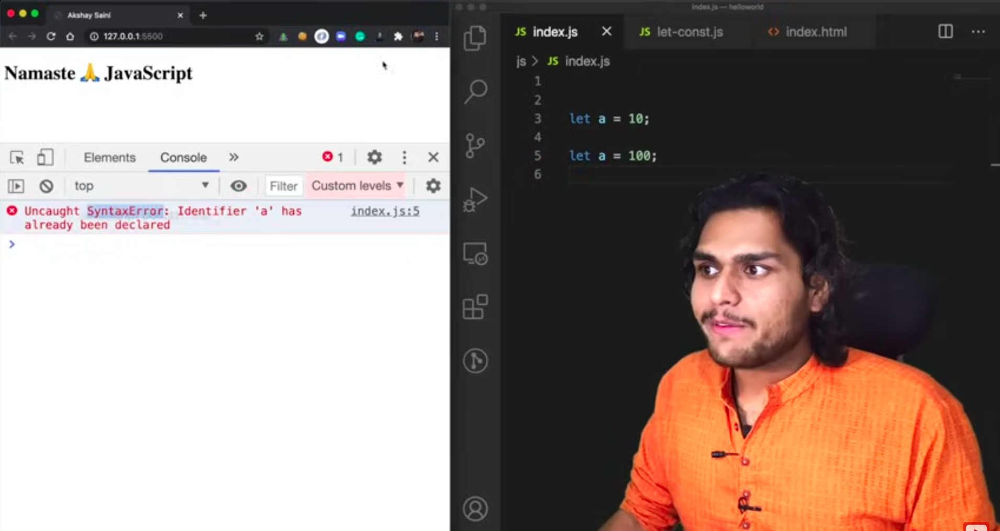

------------------------

------------------------

Observe b is attahced to global object while a is attached to an object named Script(which is a separate memory space ).

### Temporal Dead Zone

- Time span between the point when the variable is hoisted and the point when the variable is initialised with a value is called Temporal Dead Zone.

- When you are accessing a variable which is in Temporal Dead Zone, a Reference Error is shown.
- 

-------------

-------------

## Errors:

### Type Error

### Syntax Error

### Reference Error