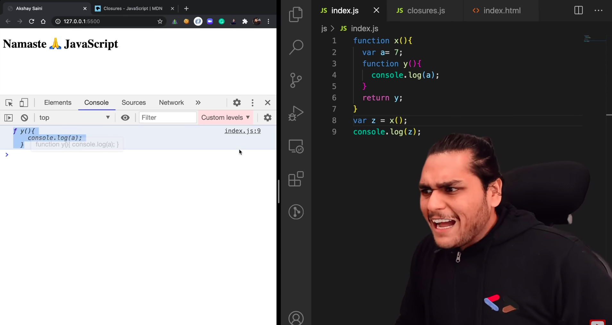
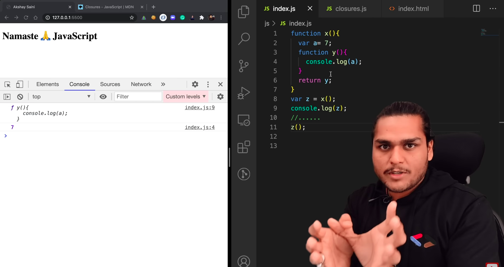

### Closure

- In JS, you can pass functions as arguments to functions and also return them.

- Closure = Function + its Lexical scope.
- Definition: Closure is a combination of function bundled together with its lexical environment.

- This image is important. When y was returned, not just function was returned, but instead, it's close was returned. Explain with the above example.

### Gotchas and corner cases in closures

### Uses of closures

