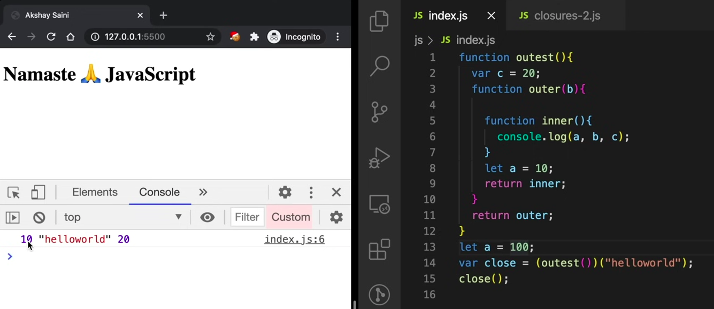

### Questions asked

- Explain Closures with examples(code it).
  

In the above image, the seconf parantheses calls the inner function as we are returning it.

It can also be written like this

Here, variable b is also a part of lexical environment.

In this image, if line number 8 was not there, it would print 100.

### Advantages of Closures
- Function Currying
- Used in higher order functions like memoize, once
- Data Hiding(privacy) and Encapsulation

### Example of Data Hiding and Encapsulation

Everyone can access counter variable here.

Anyone from outside cannot access the counter variable.

### Constructor Function

### Disadvantages of Closures

- Overconsumption of Memory because variables are not garbage collected.

### What is a Garbage collector?

- JS is a high level programming language. In languages like C, C++ which are low level, it is upto the developers how they allocate and deallocate memory. But, in JS, there is a garbage collector to handle this.
- Garbage collector freezes up the memory when it finds there are unused variables. It basically doesn't allocate memory for those unused variables.

### How are Closures and Garbage collectors related?

In this image, z will not be in memory(garbage collected) since it is unused. But, x is being used, so it is not garbage collected.