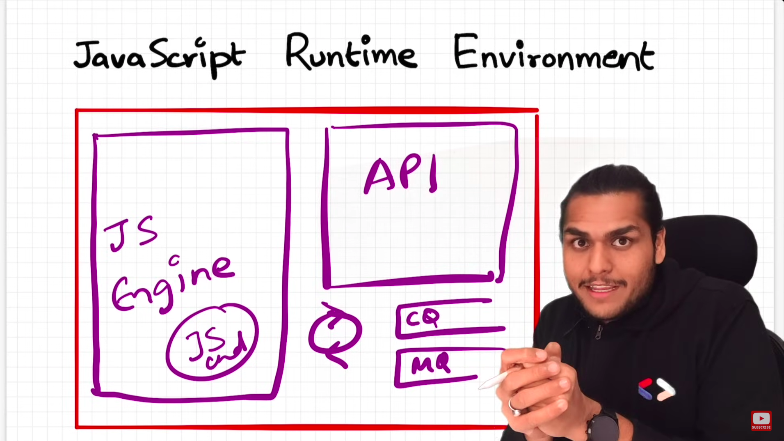

### JS Runtime Env

- Has JS Engine, APIs, Callback Queue, Microtask Queue, Event Loop.
- Browser is a JS Runtime Environment.
- Node.js is a JS Runtime Environment.
- v8 is the JS engine name of Google Chrome and Node.js
  

