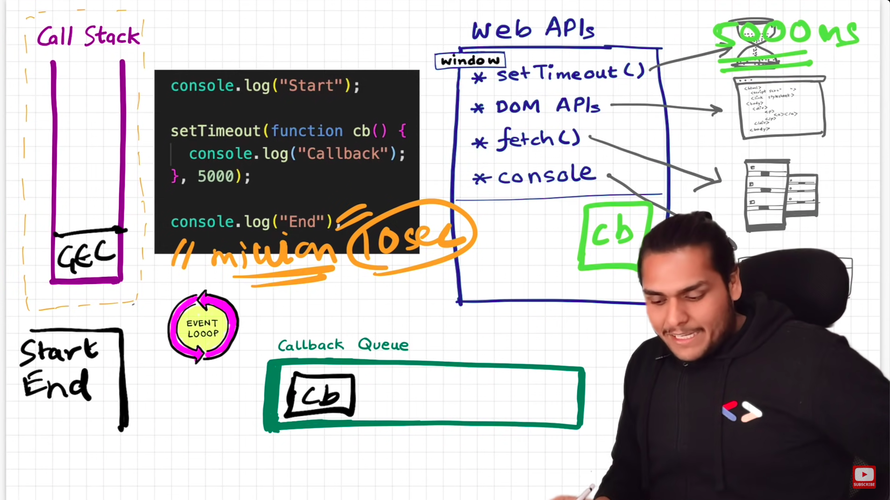
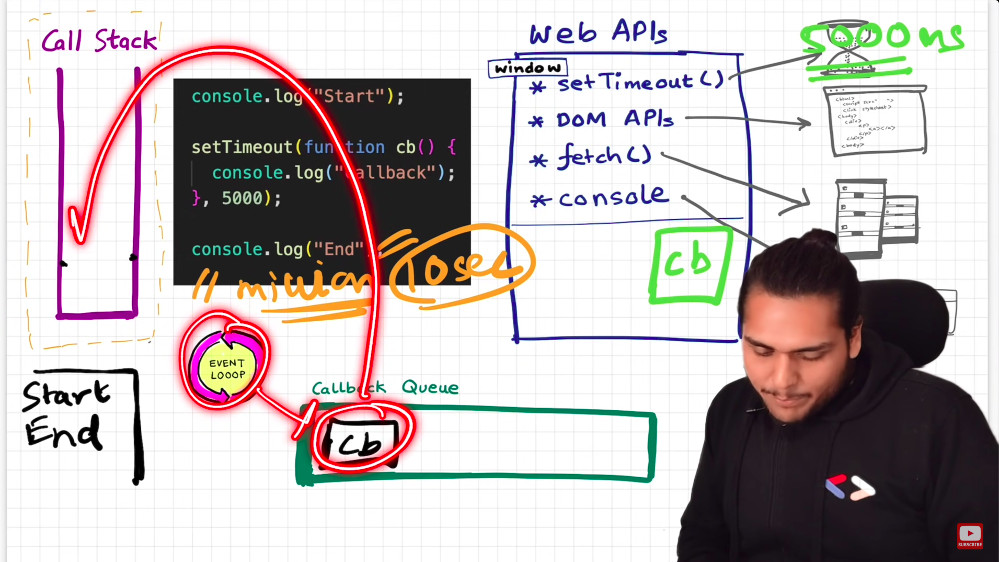
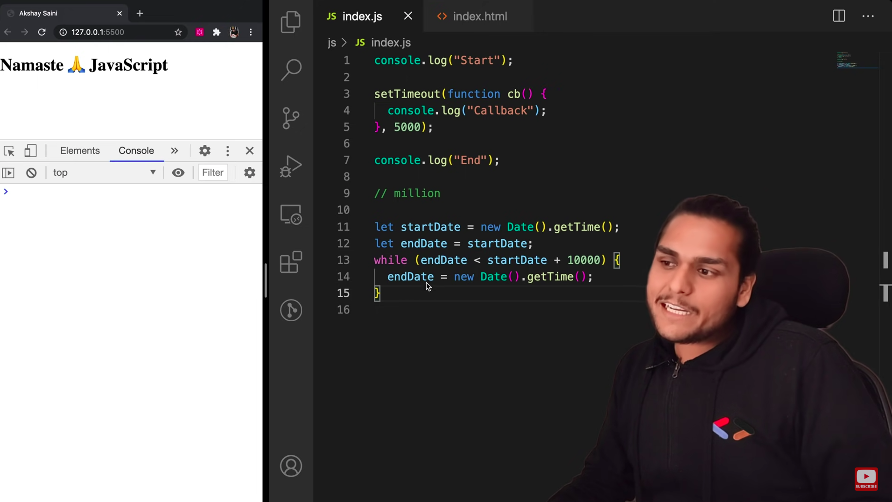
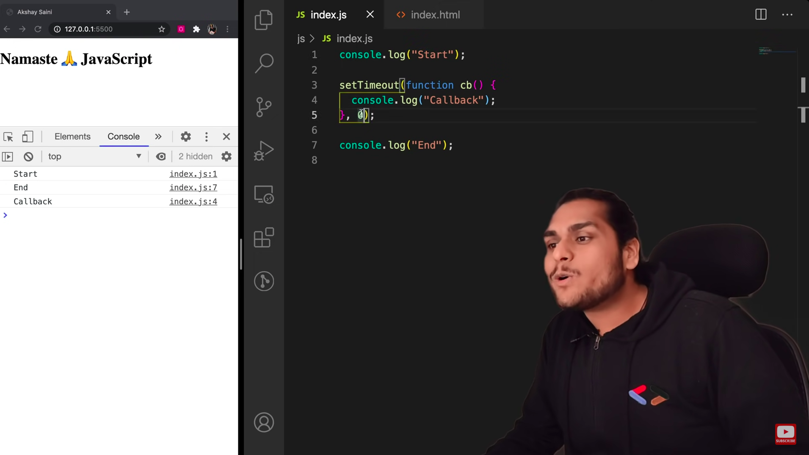

### Trust issues with setTimeout

- It is not guaranteed that callback function of setTimeout() will run only after 5 secs(in the image).

- When there are 1 million lines of code which take more time to execute(let's say 10 secs), the Global Execution Context is still in the call stack and the timer of setTimeout (of 5 secs) is expired. The callback function of setTimeout comes into call stack only when the call stack is empty.

### To fix the TimeOut issue.

### Tricky example

- Even if the timer is 0, it has to go through the call back queue. That's why callback is printed after the GEC is executed and call stack is emptied.