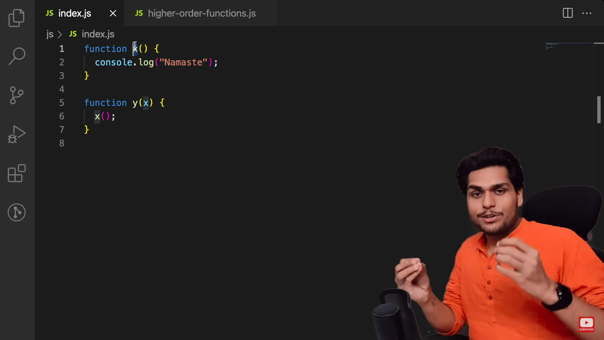
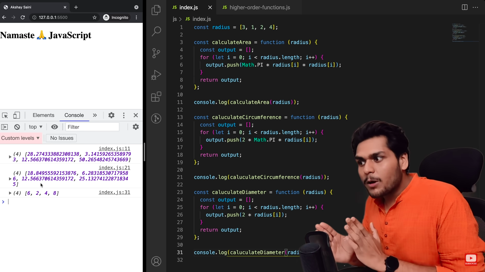
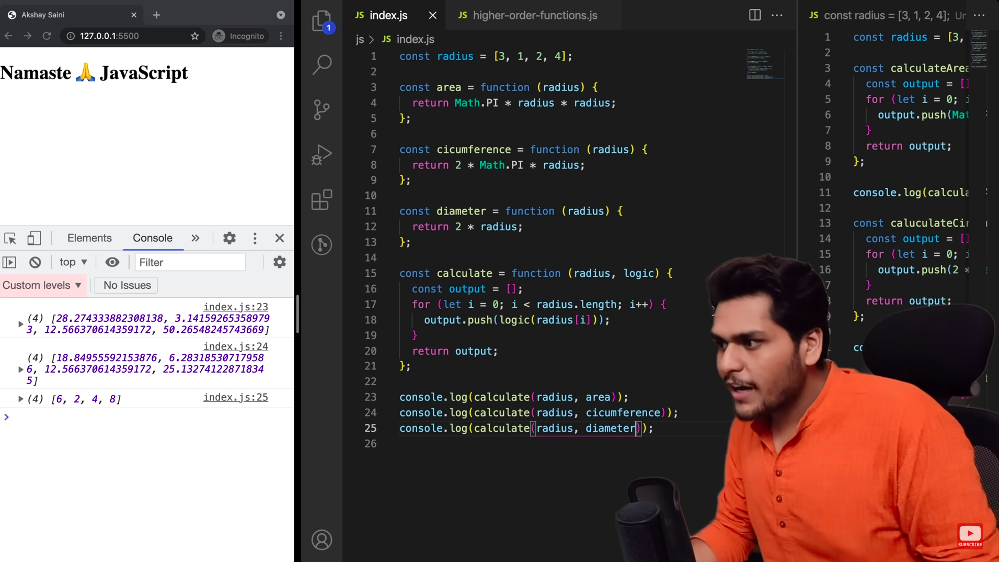
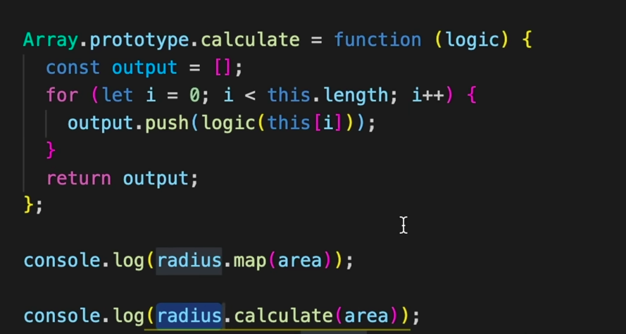

### Higher Order Functions

-  A function that takes another function as argument or returns a function is called as higher order function.

- y is the higher order function.
- x is the callback function

### Example

- All these functions have 90% similar code.

- By attaching Array.protoype, we are making the calculate function available on all the array methods. Now, calculate function will be shown to you along with map, filter etc.
- These are called polyfills
