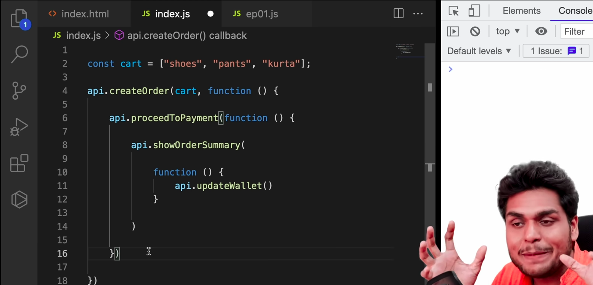
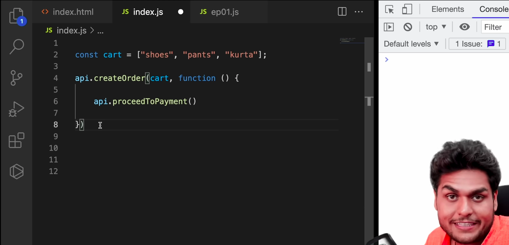

### Callback Hell

- If there are callbacks inside callbacks inside callbacks and so on, this is called as Callback Hell.

### Inversion of Control

- Here, when we are passing the callback function and relying on the API to take care, we are basically giving our control to the API. The API might have bugs, which can result in mishandling of our callback function (like callback being called twice, callback being called before order creation etc.)

### Advantages of Callbacks

-  Async programming exists because of callbacks.

### Disadvantages of Callbacks

- Callback Hell
- Inversion of Control
