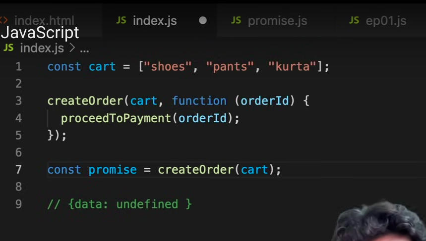
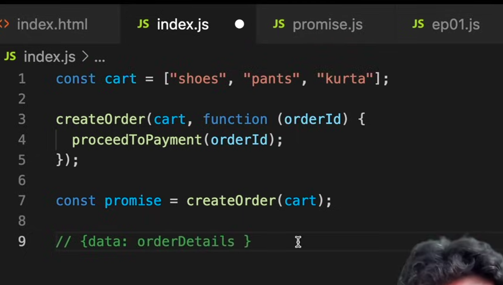
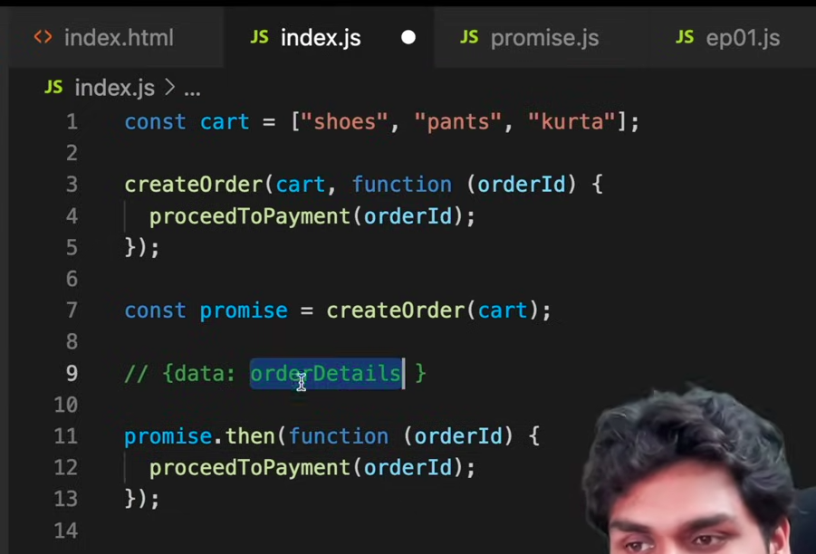
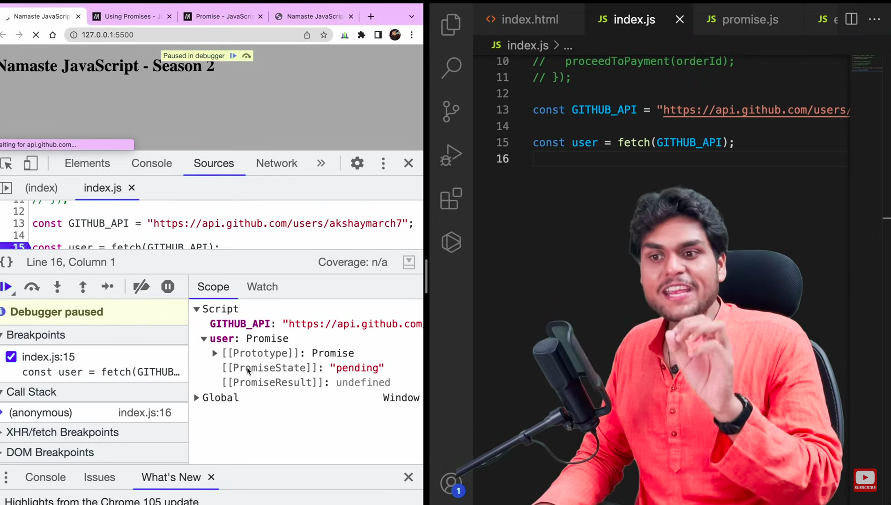
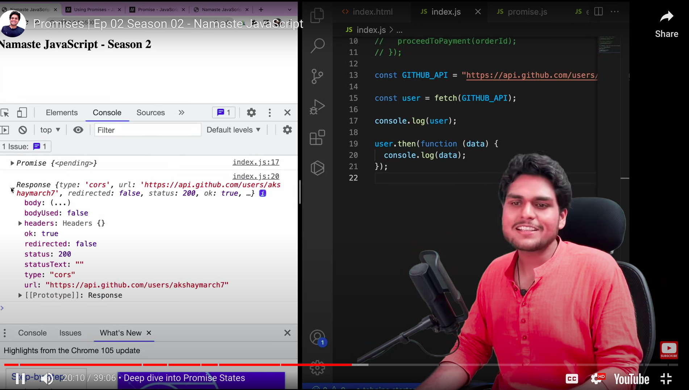
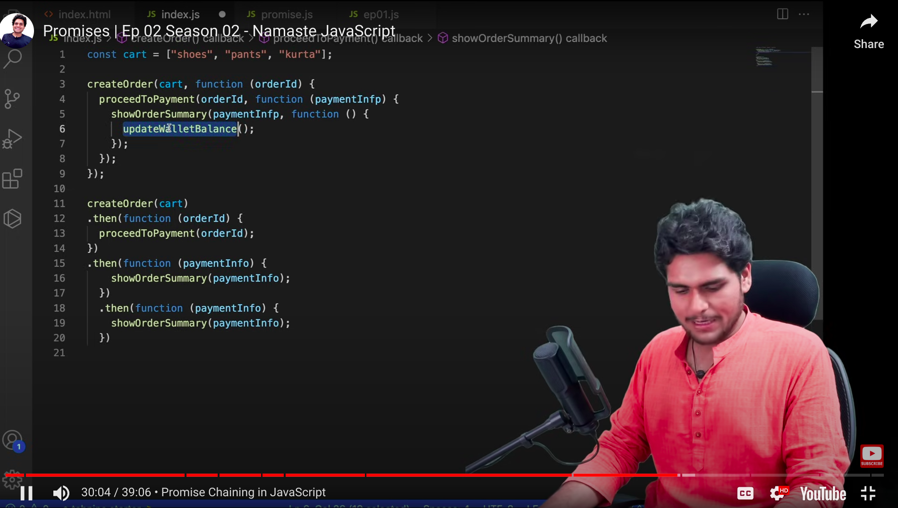
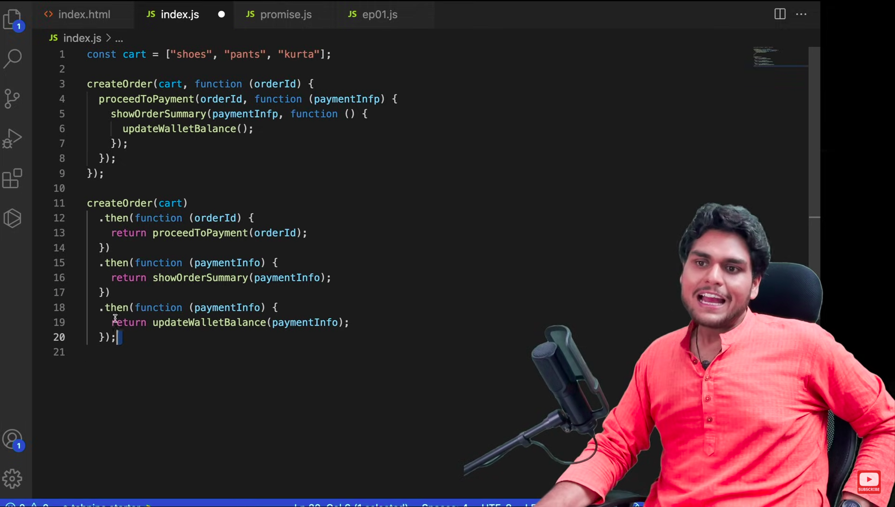
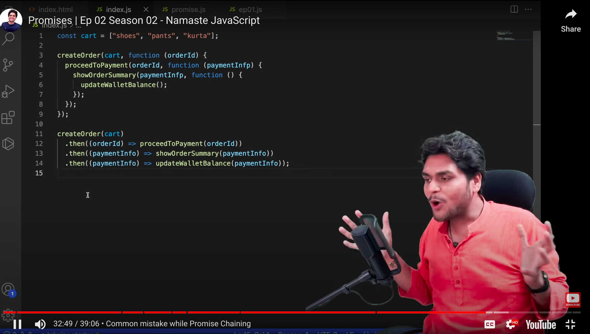

### Promises

**Proper Definition:** A Promise is an object representing the eventual completion or failure of an async operation.

- Promise is nothing but an empty object
- Initially, the data object is undefined. But, pnce the createOrder API call succeeds, the data object is filled with some data automatically.

- The callback function attached with then, will be called automatically once the promise object is filled with data from the API.

- Using .then() syntax we are **preventing Inversion of Control(control lies with us)**.

### Digging into Promise

- PromiseState -> If it is pending or fulfilled.
- PromiseResult -> The data returned from API.

### Promise Chaining

- Use return statements if you want to pass data from one function to the other in the promise chain.

