### Async-Await

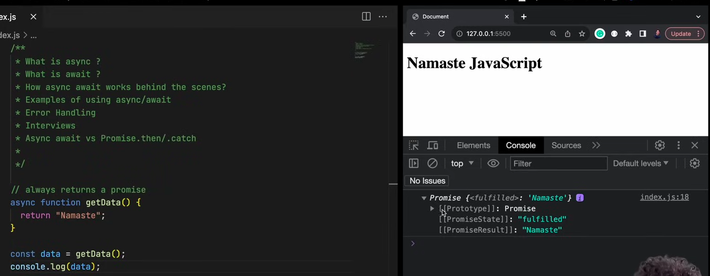

- It will always return a promise.
- Even if you return a non-prmise value like int or string, the function will wrap it inside a promise and return it. But, it will return a promise.
- If the return value is already a promise. It doesn't wrap this promise in another promise. It just returns it

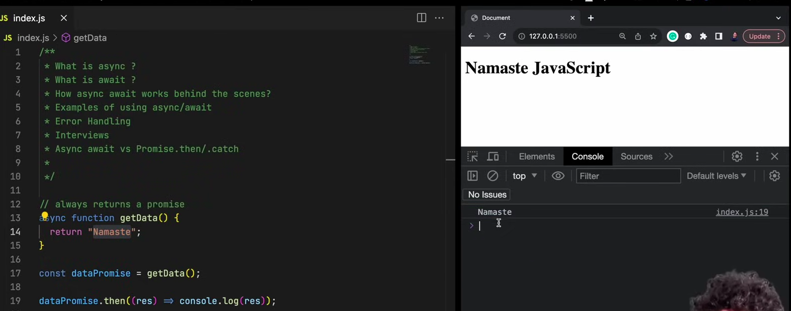

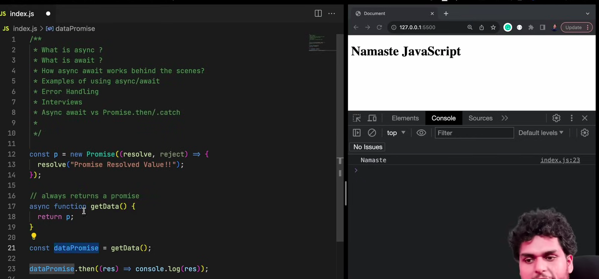

### How to handle promises using .then()

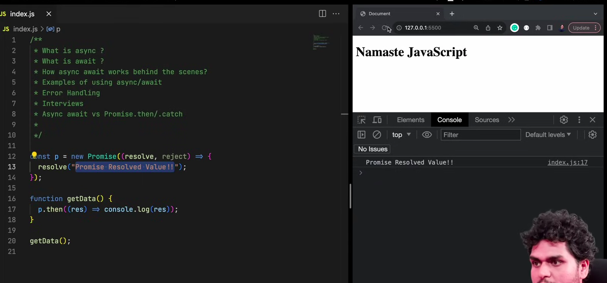

### How to handle promises using async-wait

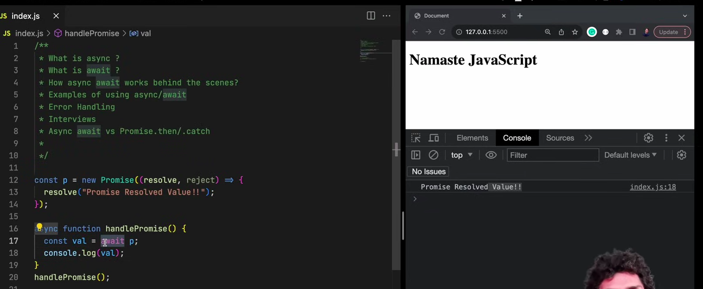

- await can only be used in an async function.

### How are normal promises resolved?

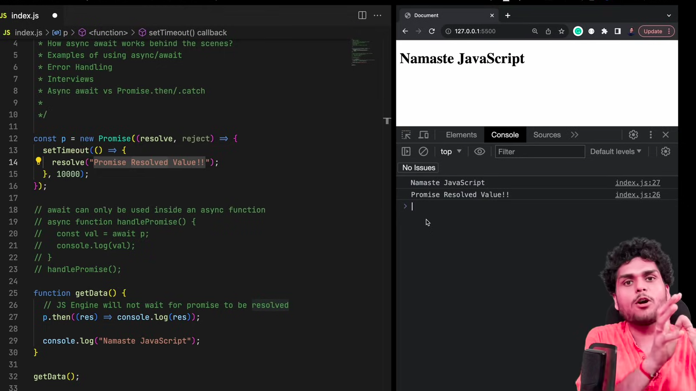

- Here "Namste Javascript" is printed and then after 10 secs, "Promise is Resolved" is printed.

### How are async/await promises are resolved?

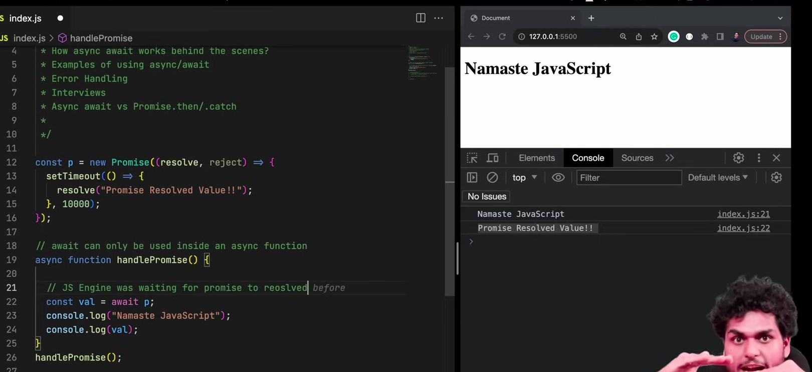

- Here, the JS engine waits at line 22(for 10 secs) for the promise to be resolved. Only after that, the console.log statements are executed.

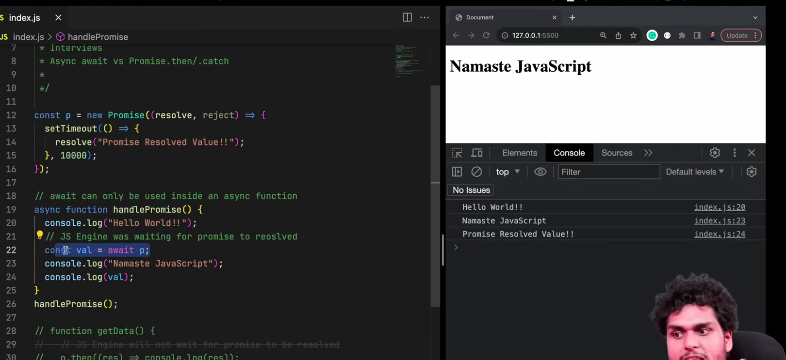

- In this case, hello world is printed right away.

### Tricky Example 1

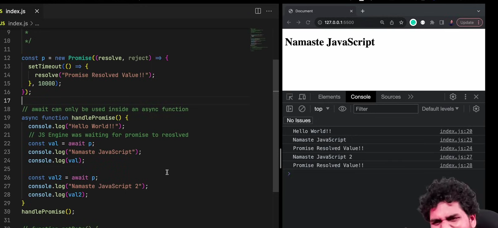

- Here, hello world is printed right away. But, after 10 secs, all the other print statements are executed. 
- We tend to think that since there are 2 awaits, first print will be executed after 10 secs and then second print will be executed after 20 secs. **But, it's not the case.**

### Tricky Example 2

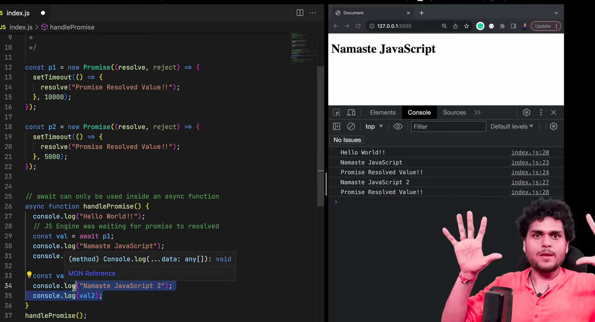

- In this example, hello world is printed right away. But, after 10 secs, all the other print statements are executed even though there are two promises which will be resolved in 5 secs and 10 secs.

### Tricky Example 

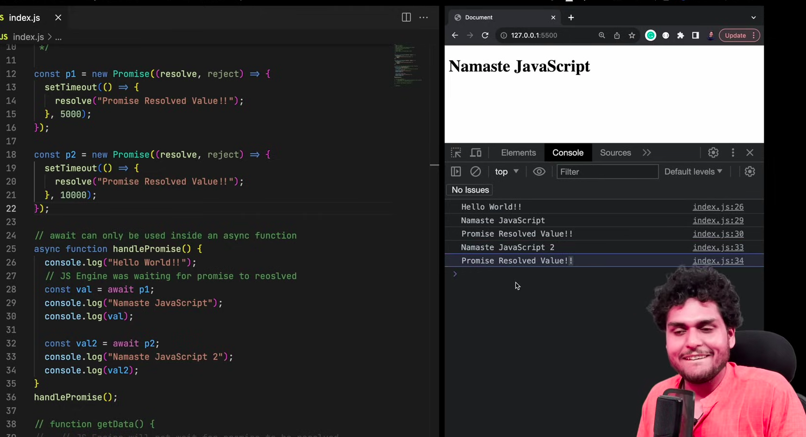

The timers are reversed here.

- In this example, hello world is printed right away. But, after 5 secs, the first set of print statements are executed and after 10 secs the second set of print statements will be executed.

### What's happening behind the scenes.

- If JS sees that a promise(using await) is not resolved, it will suspend(or remove) the function from the callstack until the promise is resolved.
- Once the promise is resolved, the function comes back into the call stack and start executing.

### How Fetch works?

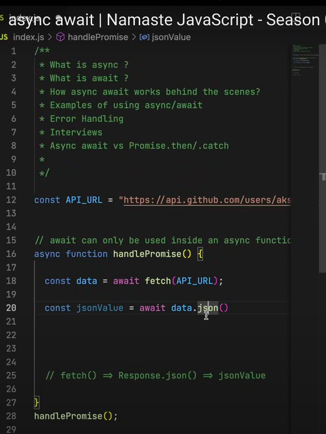

- Fetch is a promise. It returns a Response object when it is resolved.
- To get data out of it, we need to convert Response object into json which is again a promise.
- That's why we are using two awaits.

### Error Handling in Async-Await

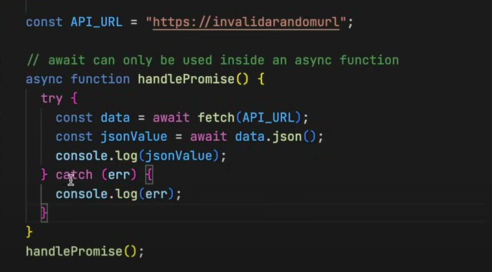

