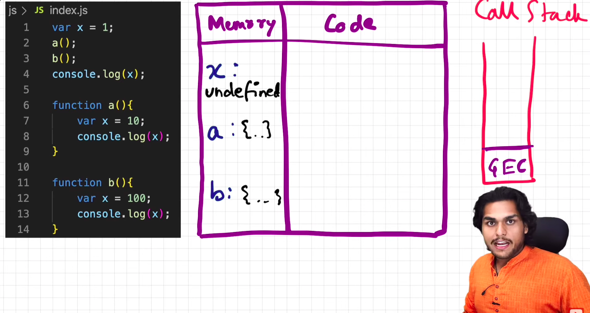
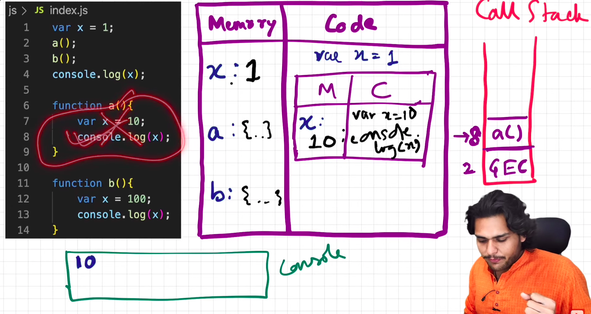
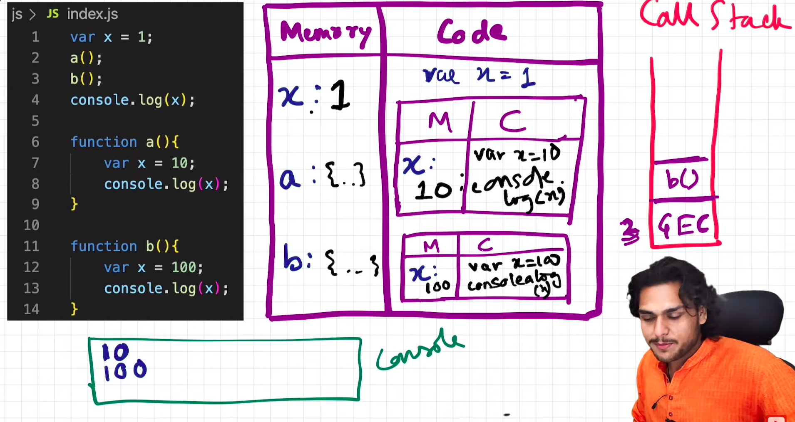
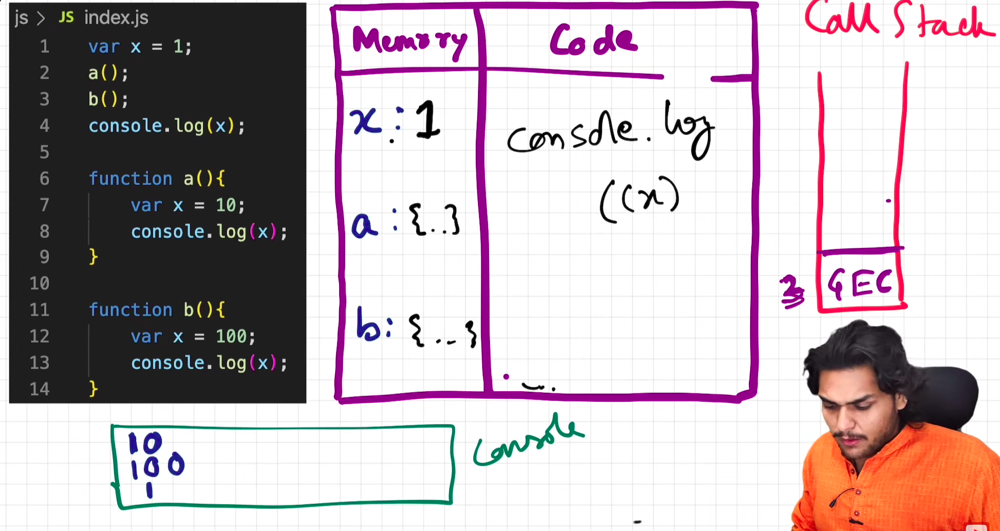
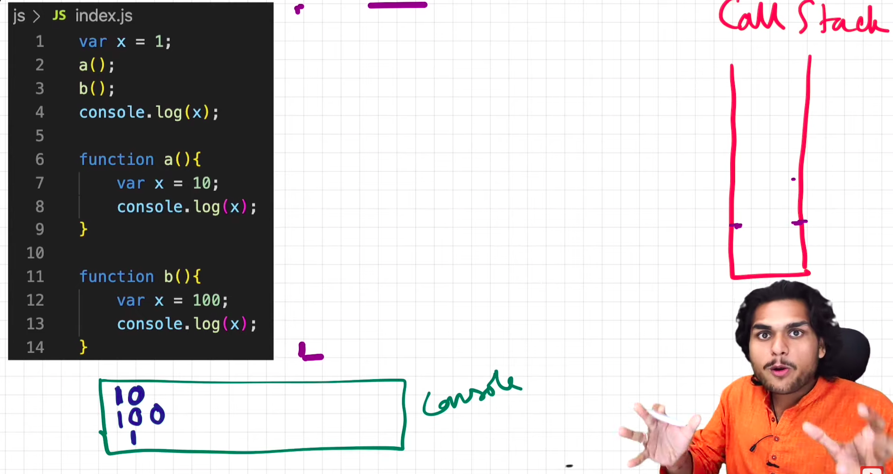

### Stage 1

--------------------------

### Stage 2

---------------------------

### Stage 3

---------------------------

### Stage 4

---------------------------

### Stage 5

----------------------------

### Printing a variable takes the variable from the local execution context.