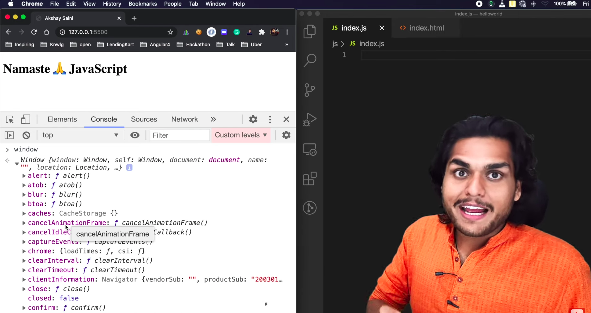
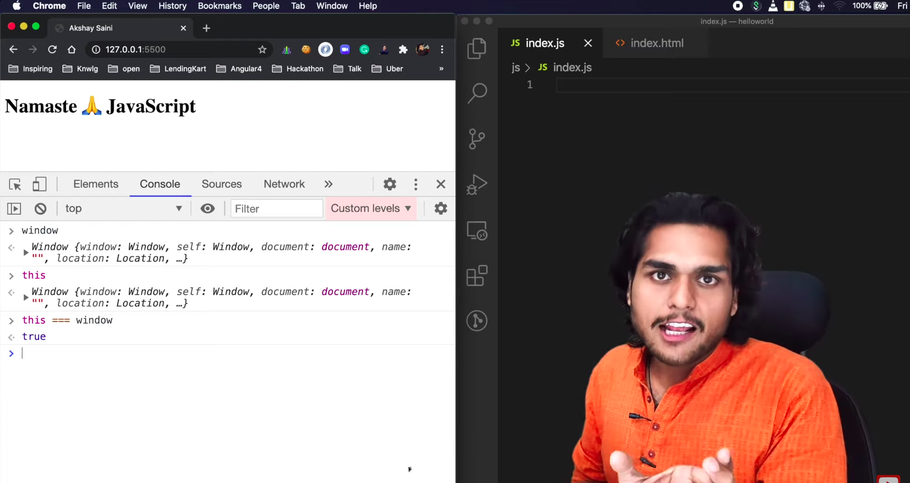
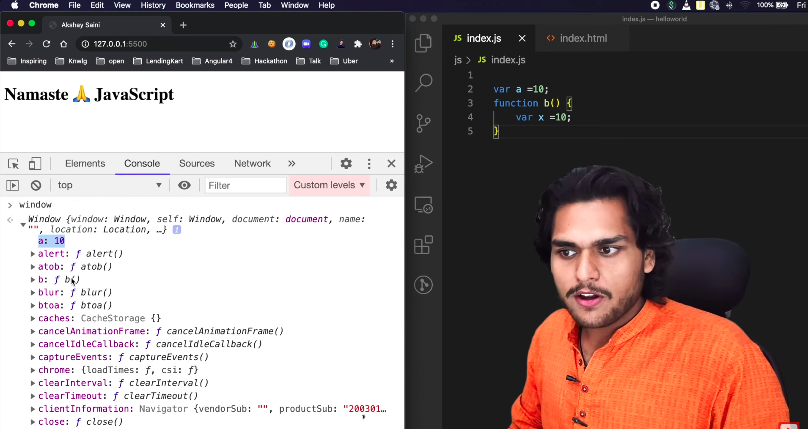
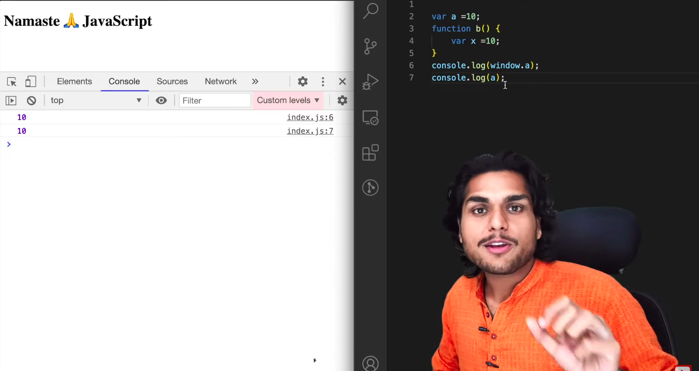
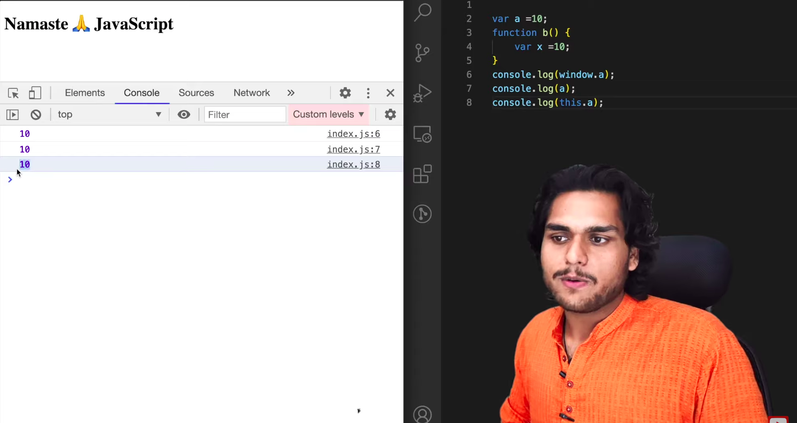

### Empty file is the shortest execution program

-------------------------

-------------------------

### What is window object?

Window is a global obect created along with Global Execution Context. Created by JavaScript Engine.

- Anything which is not inside a function, it is global space. Variables that are not in fucntion are present in Global object.

### What is this keyword?

'this' is an object created whenever an Execution context is created.

In Global Execution Context, 'this' is equal to window