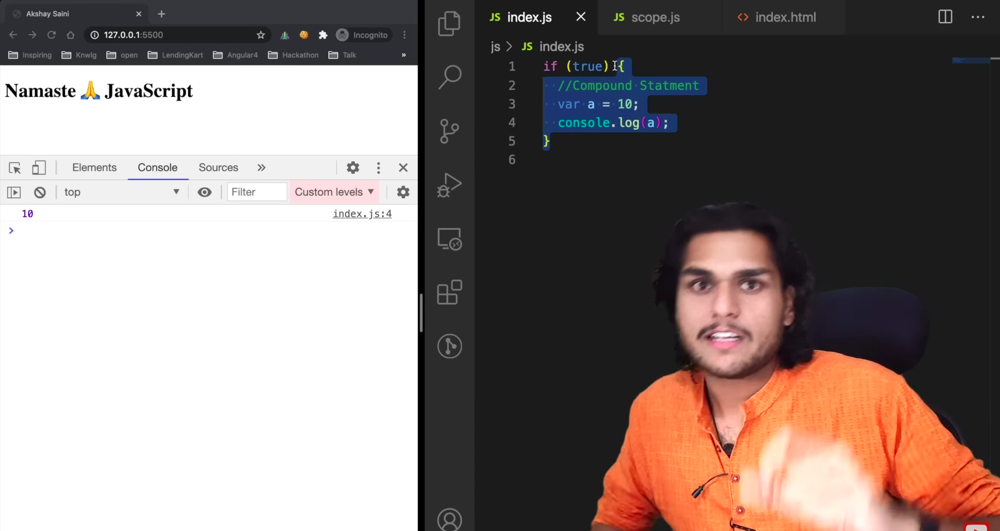
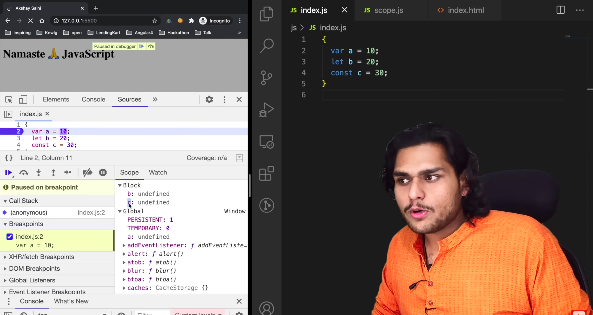
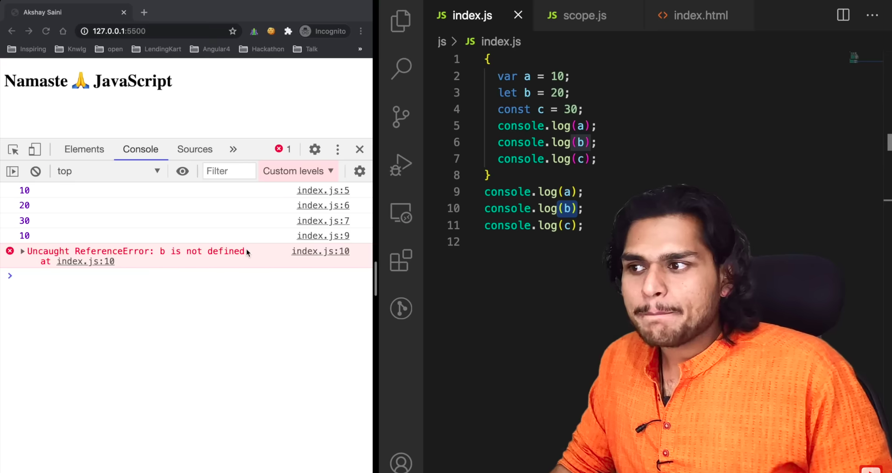
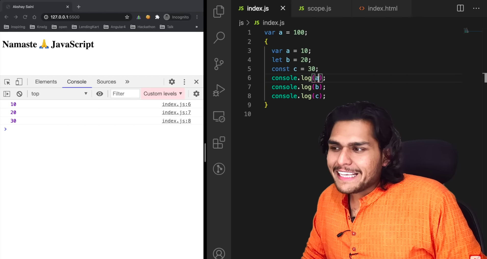
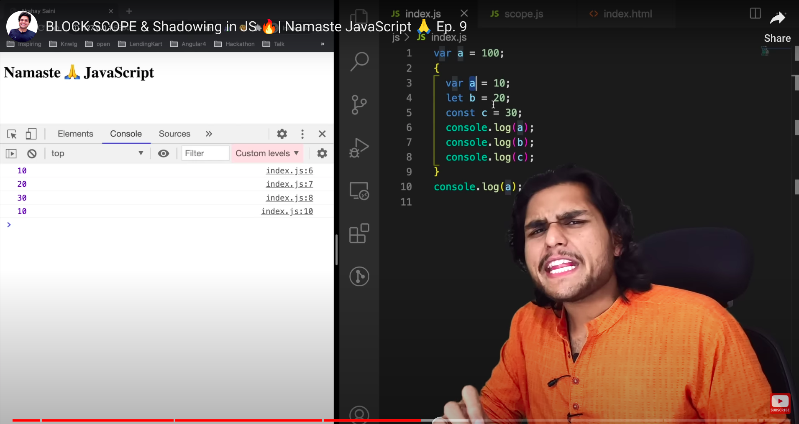
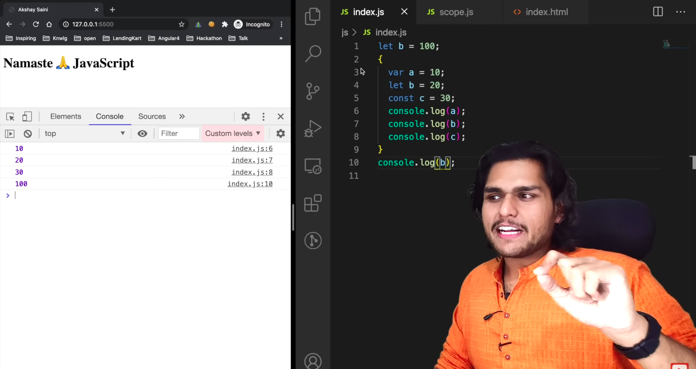
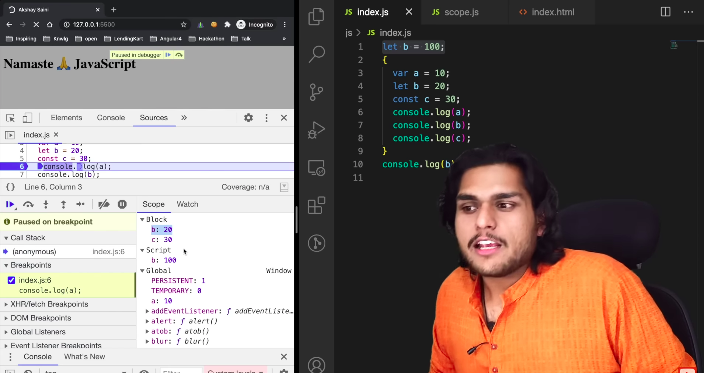
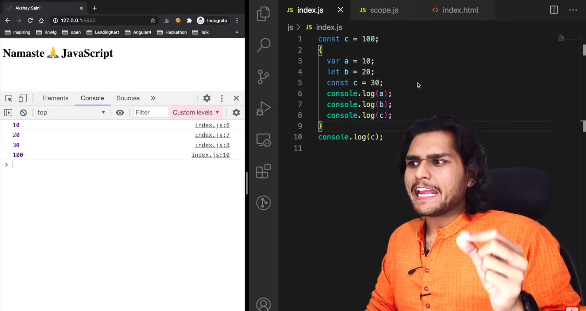
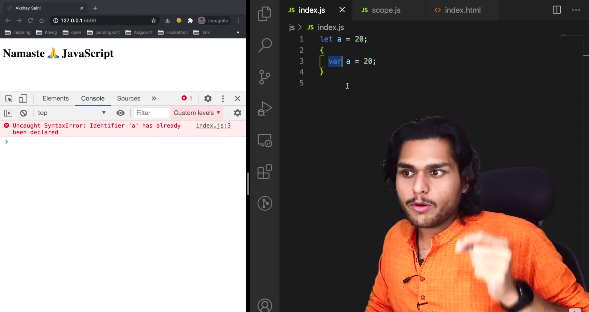

### Blocks

- It is defined by curly braces.
- We use blocks to make a group of statements to make it consider as one statement.

### Scope

- let and const are block scoped.

### Shadowing

-----------------

------------------

------------------

### Illegal shadowing

### Re watch this video and the let and const video.