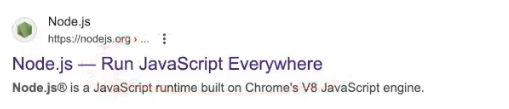
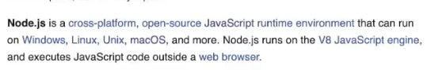
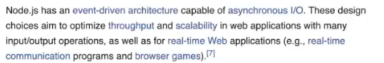

### What is Node.js

- v8 engine is synchronous but Node.js is asynchronous (asynchronous IO or non blocking IO becuase it is not blocking main thread.)

- Async IO is also called as Non-blocking IO