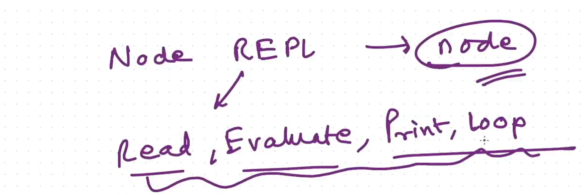
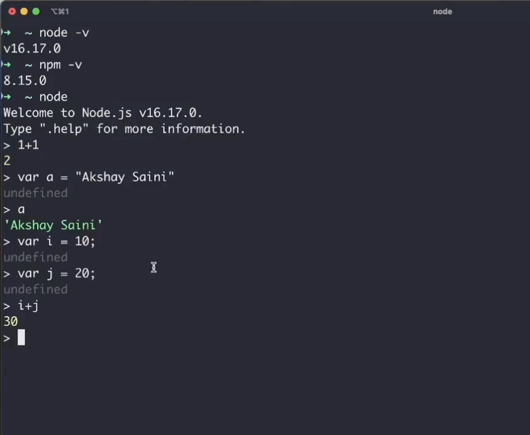
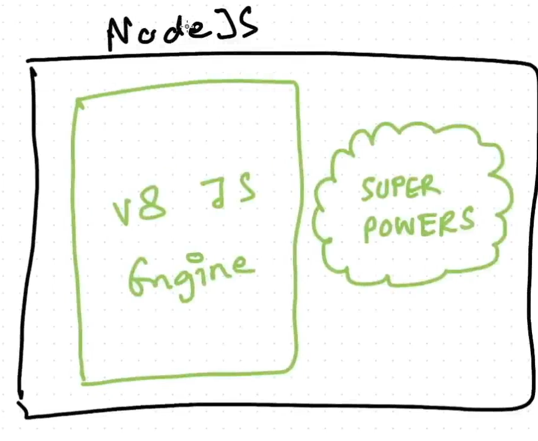
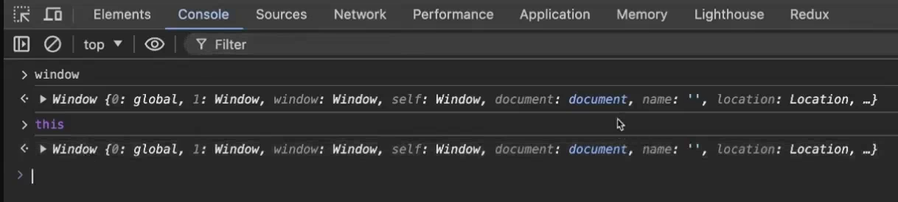
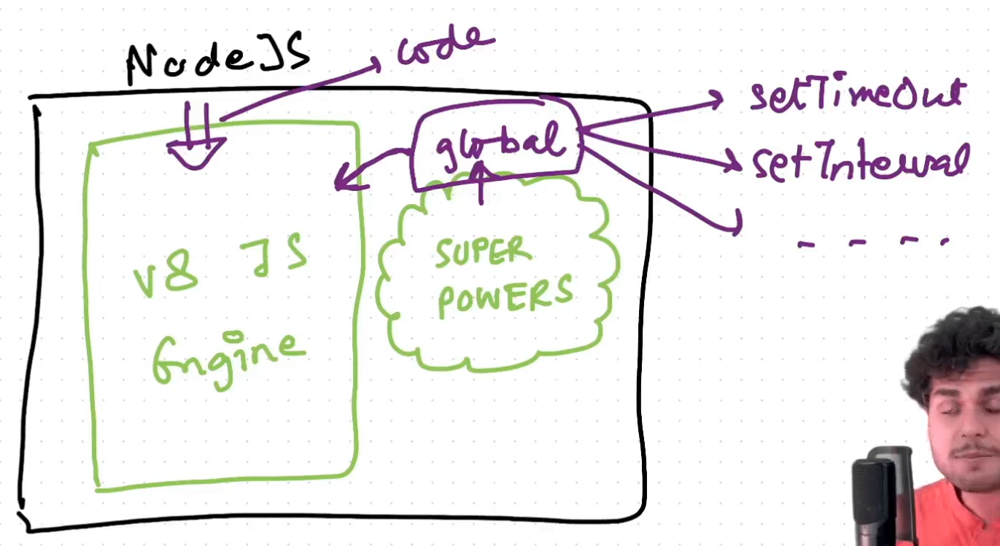
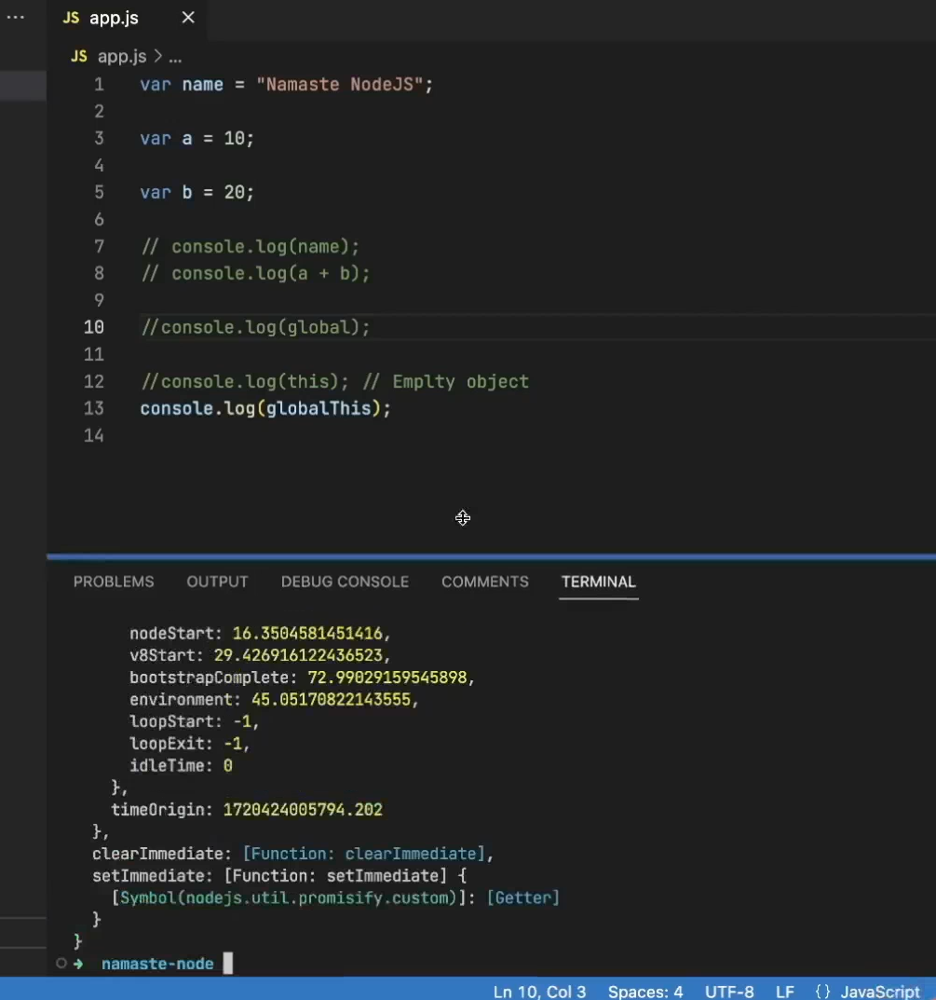

### Node REPL

- Quickest way of running Node.js is Node REPL.
- You can launch a Node REPL using command `node`

------

- Global is not a part of v8 engine. It was given by Node.js.

----

-  You can use globalThis in both Node.js and browsers.
