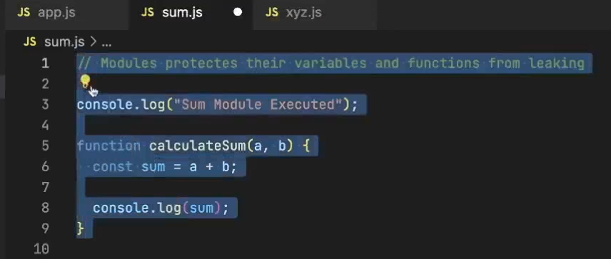
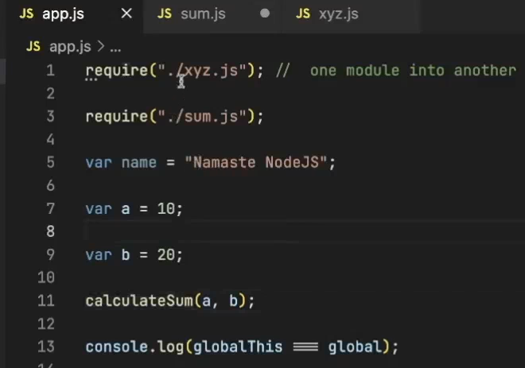
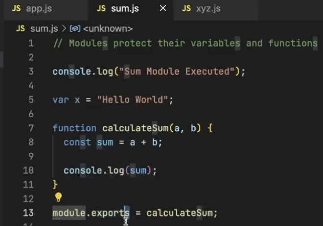
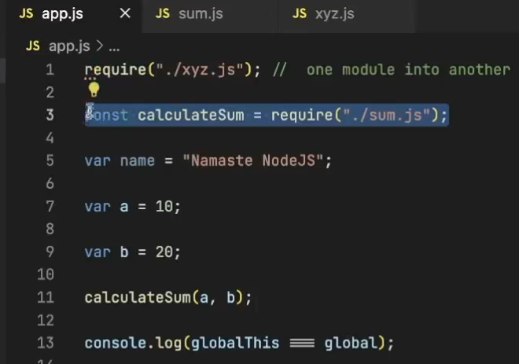
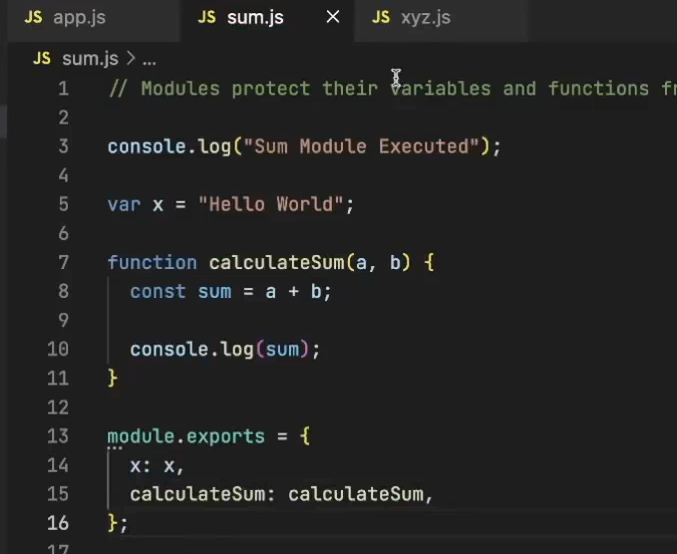
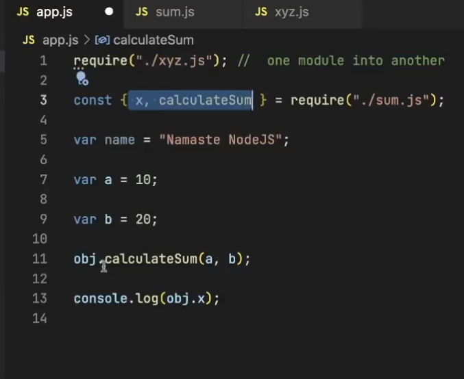
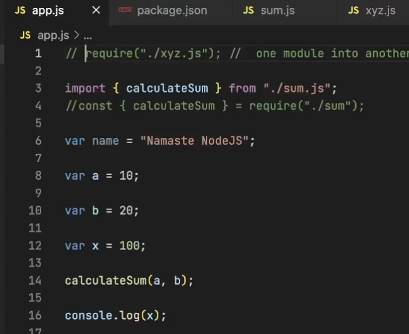
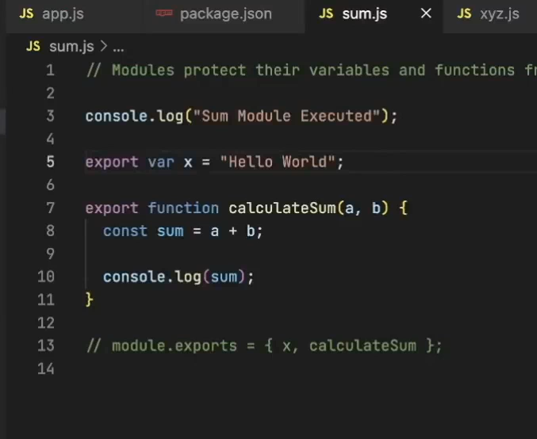
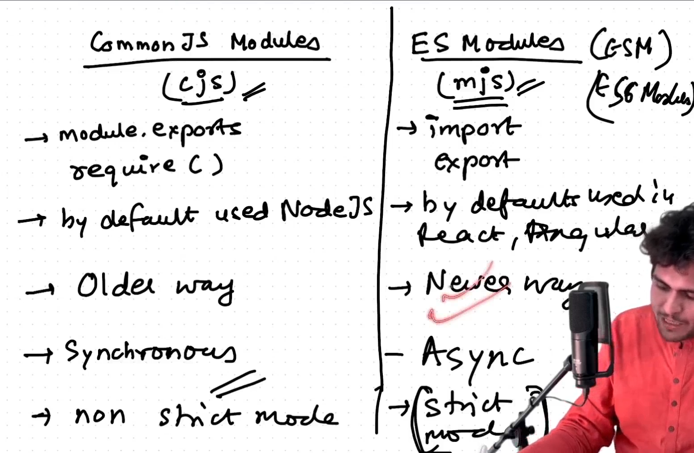
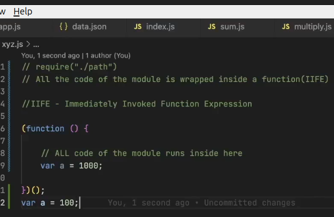

## module.export and require

- If you simpley write require, the code in the sum.js will be executed if you run app.js. But, the variables and functions of sum.js are private(protected) by default. So, you cannot access them in app.js

### If you want to import the functions and variables, do this

**Another example**

---

### Types of Imports

**ES Modules**

---

### Differences

### IIFE

