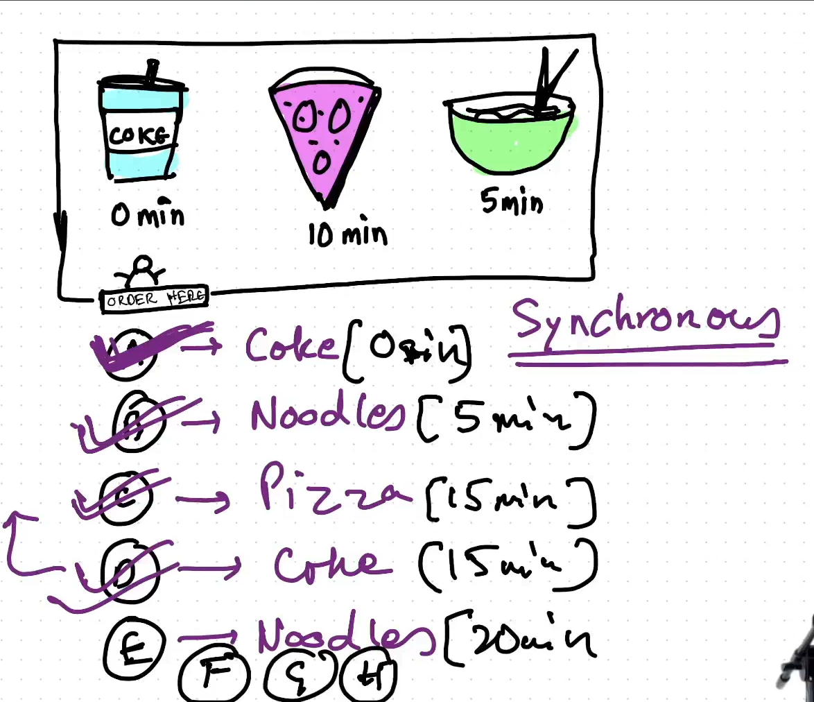
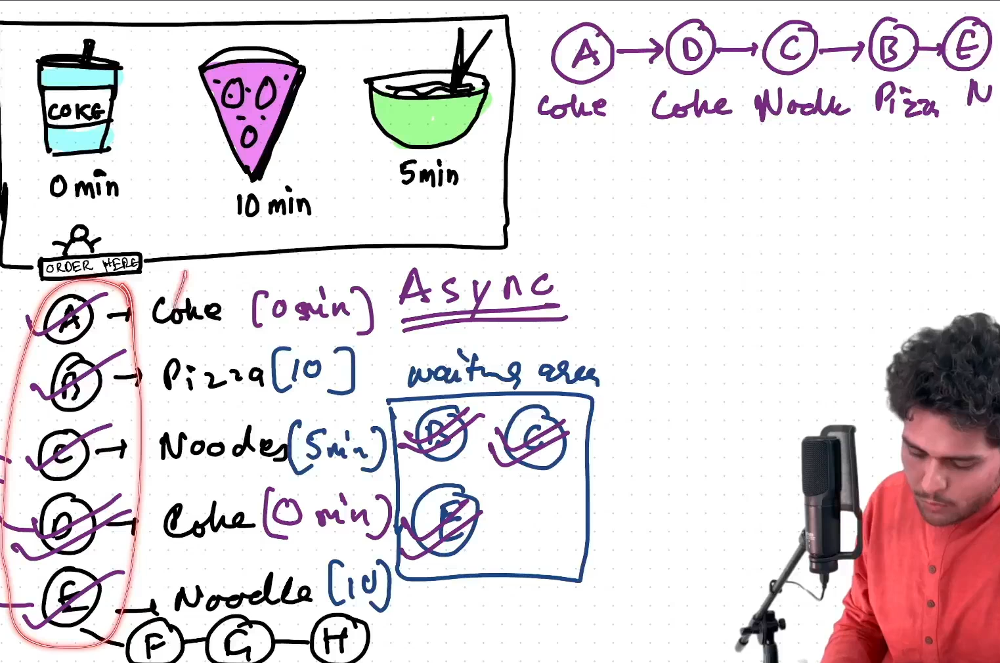
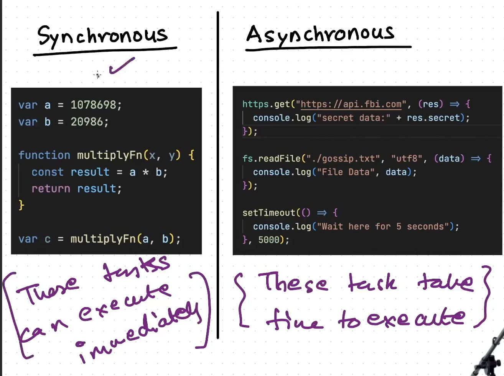
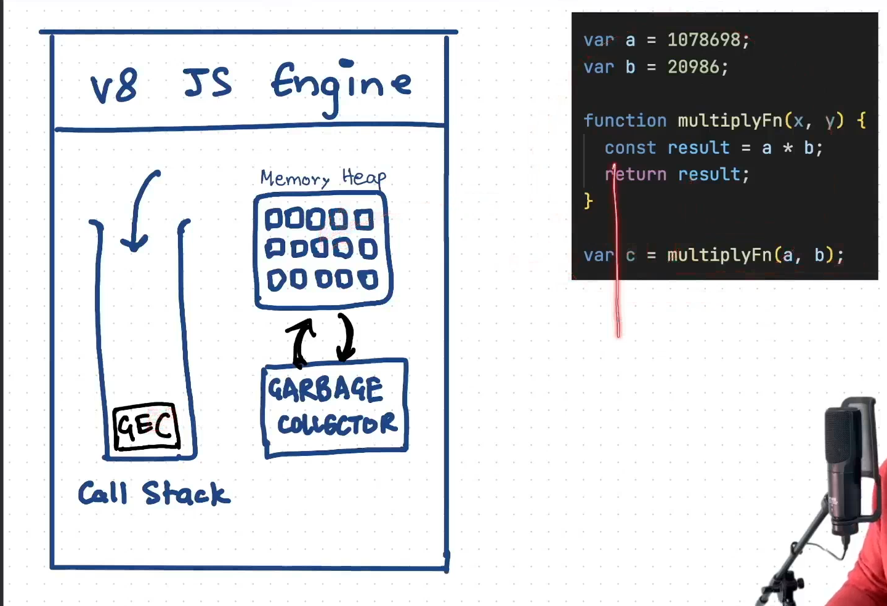
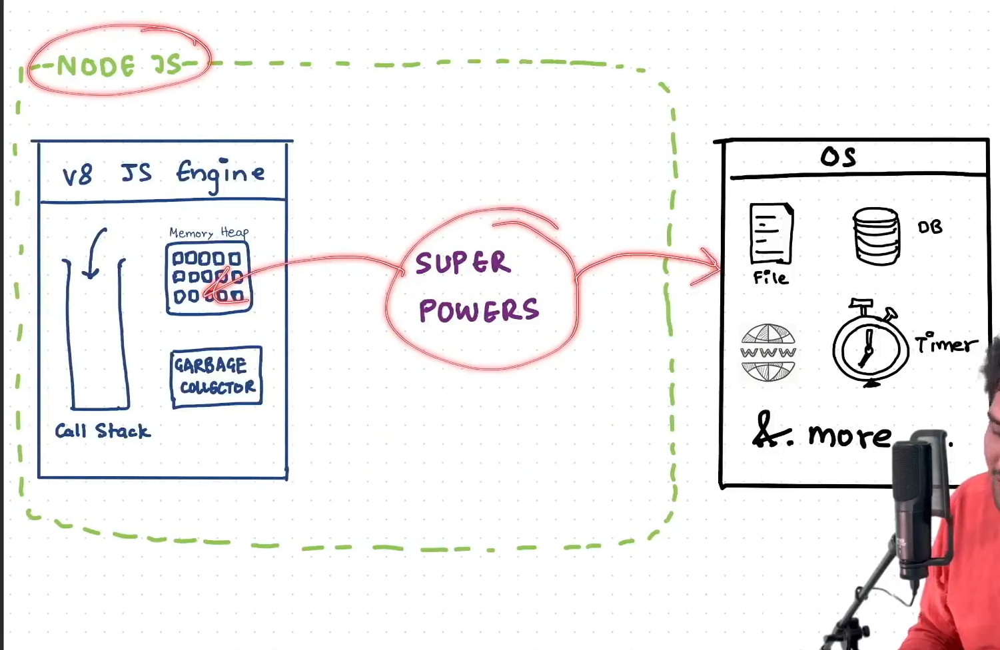
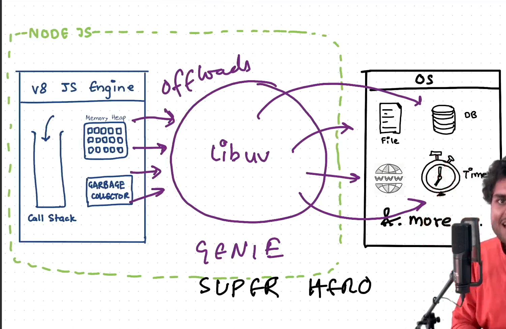
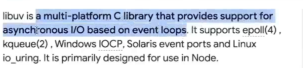
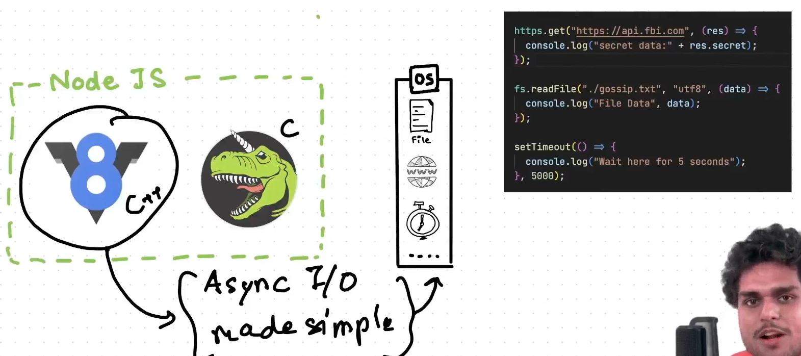
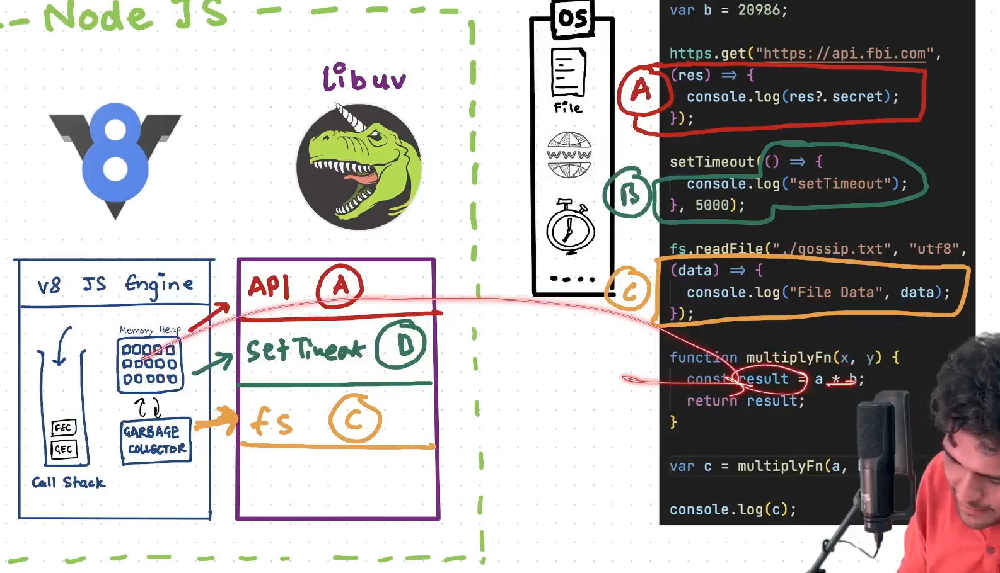

### Async and libuv

- JS is synchronous but Node.js can make it work asynchronous.

### How synchronous code is executed?

### libuv

- **libuv**(written in c) has event loop, thread pool, timers, file system etc.

### How asynchronous code is executed?

- v8 engine just offloads the async tasks to libuv and moves to next line.
- As soon as the async functions are executed, the call back function (a or b or c) is pushed into the v8 engine's call stack.