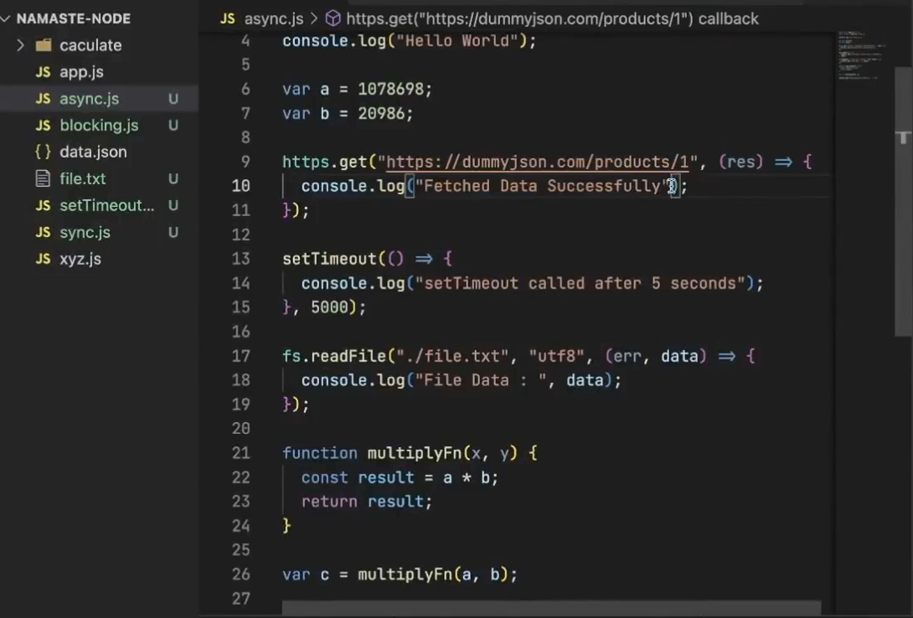
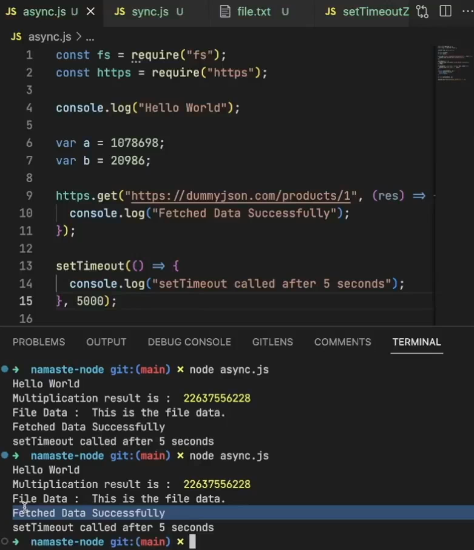
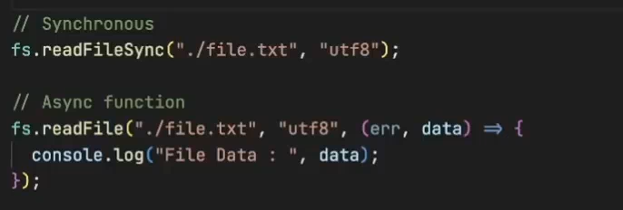
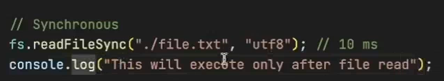
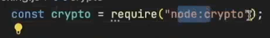
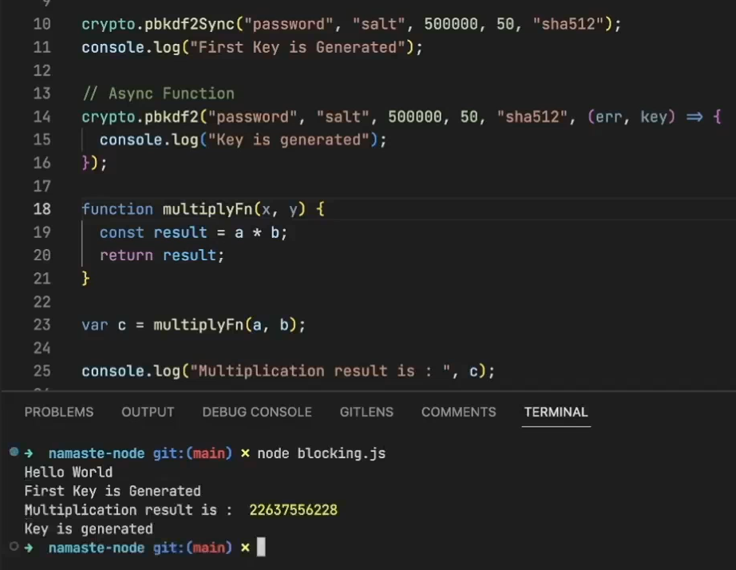
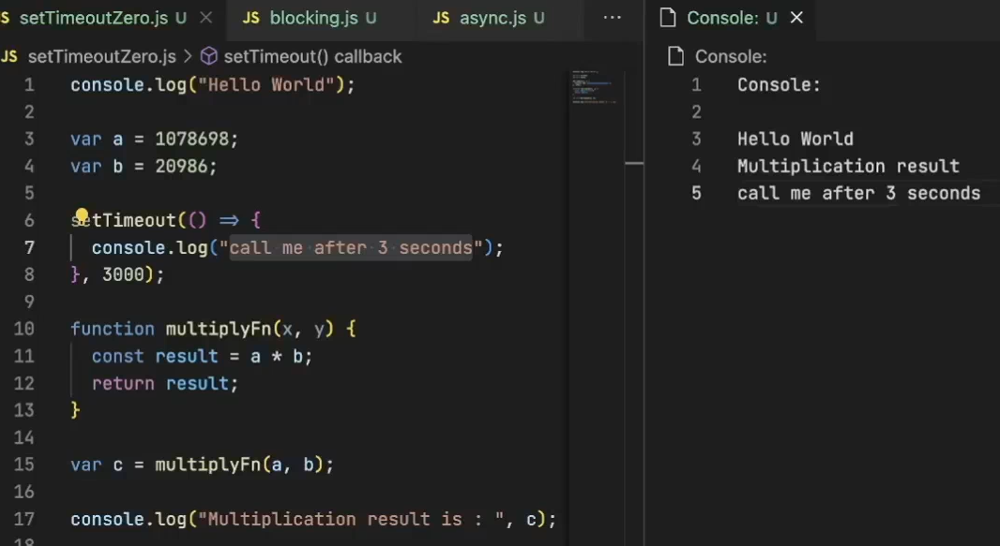
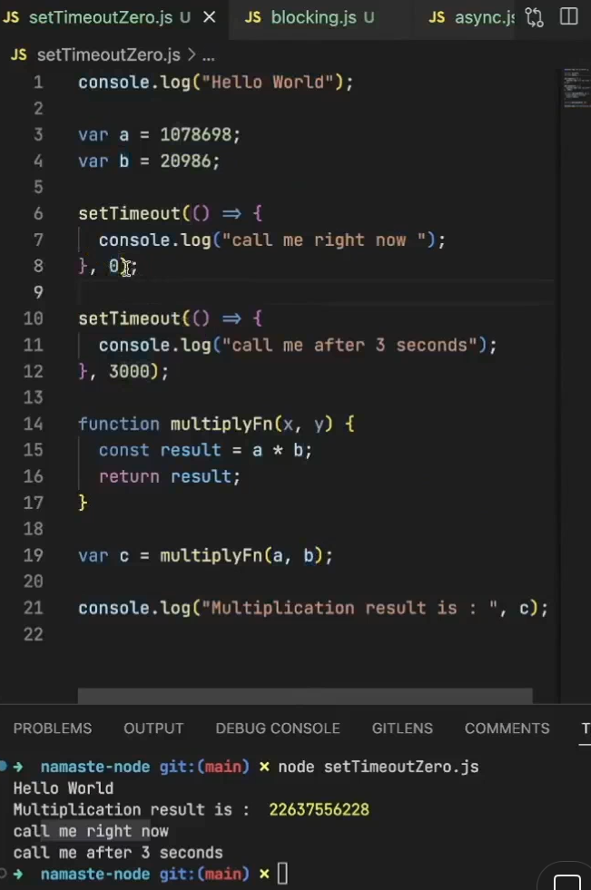

- The first two lines are executed very fast. Then the third line, then the fourth line and at last the setTimeout.

### What's happening behind the scenes

- Whenever Node.js sees code like API calls, file reads, setTimeouts, it will offload these tasks to libuv(because Node.js itself cannot read files, make API calls etc.) and moves to the next lines and execute synchronous code. Once, libuv finishes the async tasks, it will push the callbacks to the callstack and then these callbacks are executed by Node.js

----

### File system

- fs.readFileSync() is a synchronous function. **Node.js will offload this function to libuv**. Since it is synchronous function, this function will block the main thread.

- This means it is a core node.js module

### Crypto async operations

### setTimeout of Zero (Outpuut question can be asked)

- In the above example, "Helo world" is printed. Then, setTimeout is offloaded to libuv. Then, multiplication result is printed. After 3 secs, the libuv sends the setTimeout callback to callstack **only when the call stack is empty (If call stack is not empty, it will wait for it to become empty. Callstack will be empty only when all the code in the file is executed and GEC is popped out of the call stack.)** and "call me after 3 seconds is printed".

**If you give 0 milliseconds in setTimeout, it will be executed in 0 millisonds after the callstack is empty(how much time will it take for callstack to become empty? Depends on the number of lines of code)**

Make sure you know the above.

