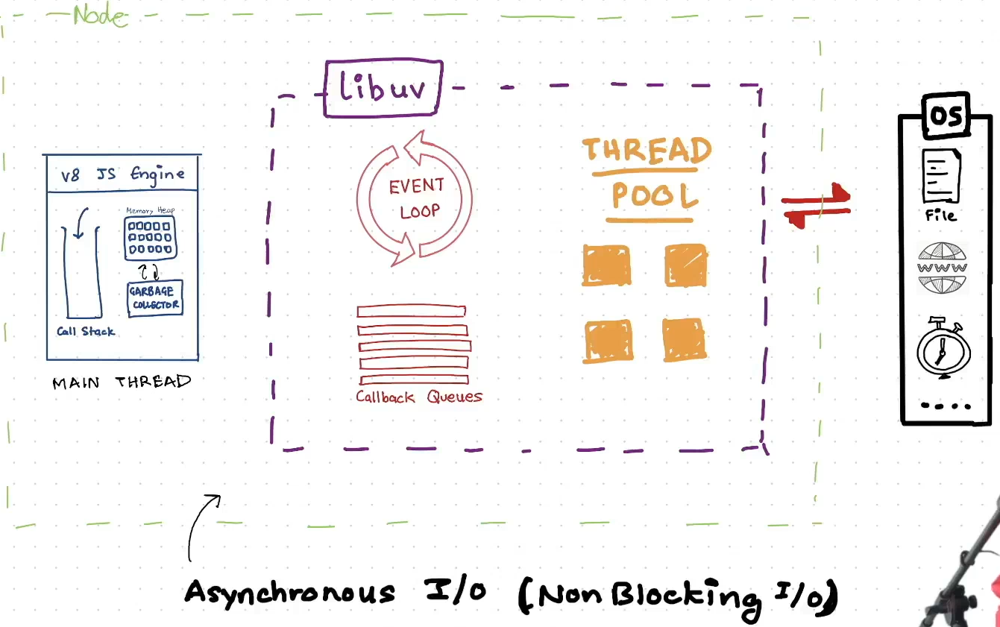
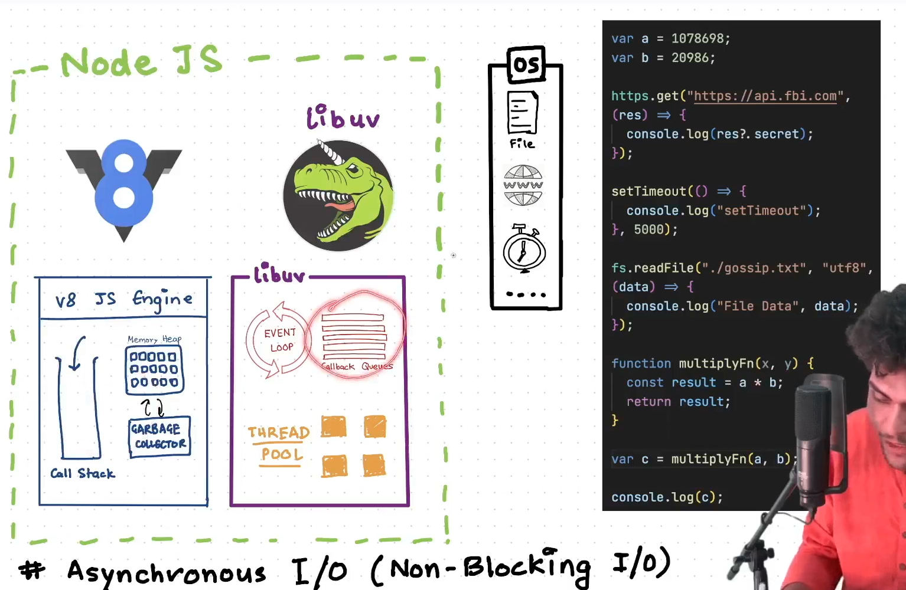
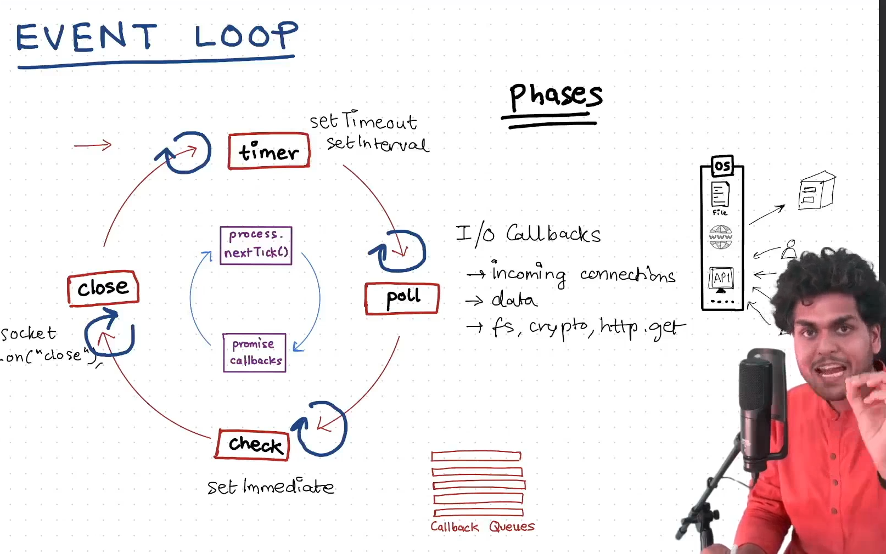
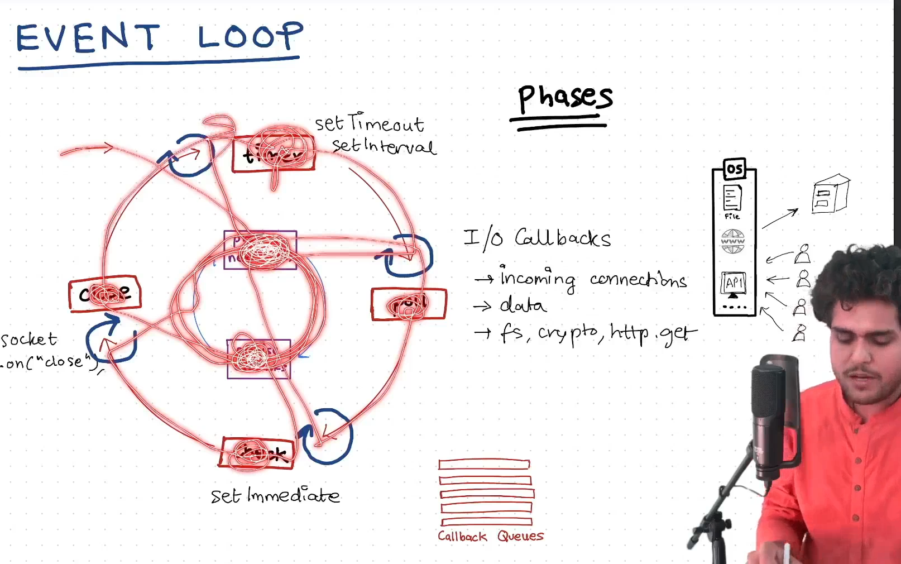

### libuv

- libuv is the thing which makes asynchronous IO possible in Node.js

- If the JS Engine is busy(i.e., callstack is not empty) the callback functions from the async tasks come from lbuv and stay in the callback queue until the JS engine is finished executing tasks
- Event loop is like a loop, it keeps running. It constantly keeps checking the callstack and callback queues.Once it finds there are items in callback queues and the callstack is empty. It takes one of the tasks and give it to callstack.

### Event Loop

- The inner cycle(blue cycle) is a kind of priority cycle. It runs before each phase of the event loop(outer circle).
- Each phase(outer circle) will have a separate queue

**Watch the Event Loop video again later. There are more things to be covered here.**