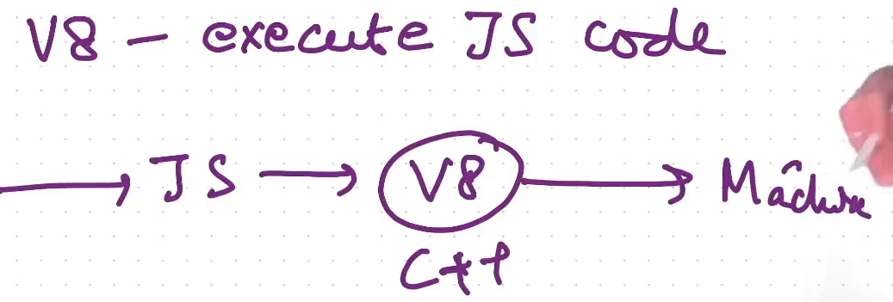
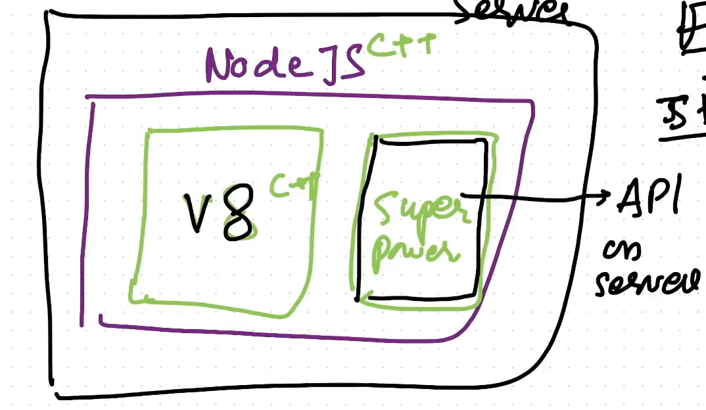
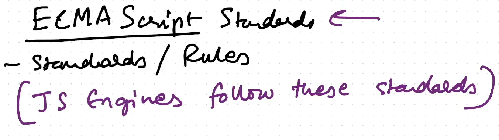
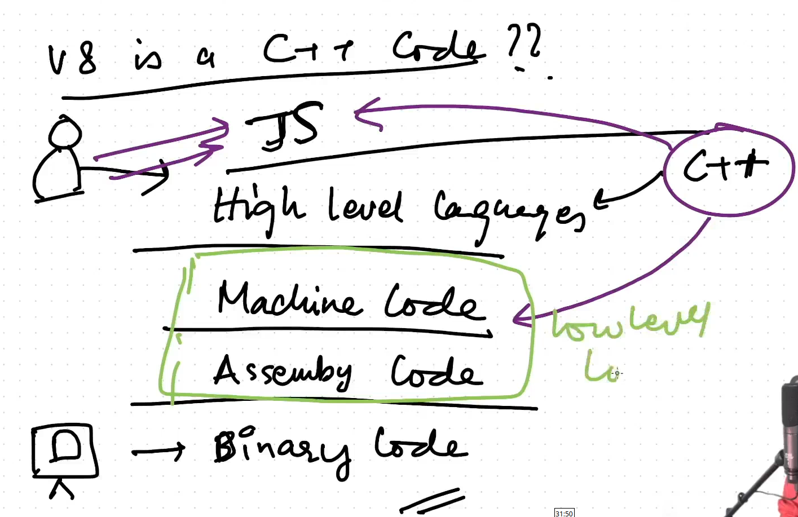
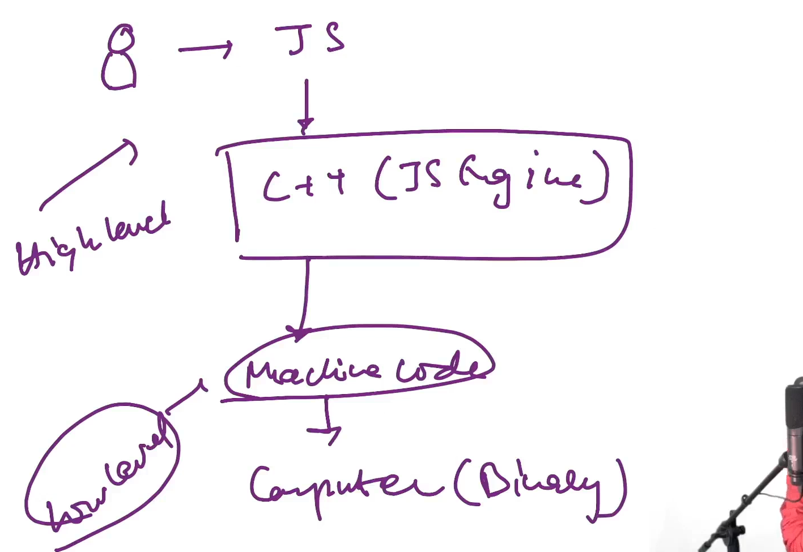

### JS on server

- v8, which is Google's JS engine is written in C++

- JS Engine converts JS into machine readbale code.

- So Node.js is a C++ program with some super powers(DB APIs etc) and v8 engine

----

---

- C++ basically converts JS(high level code) into low level code.