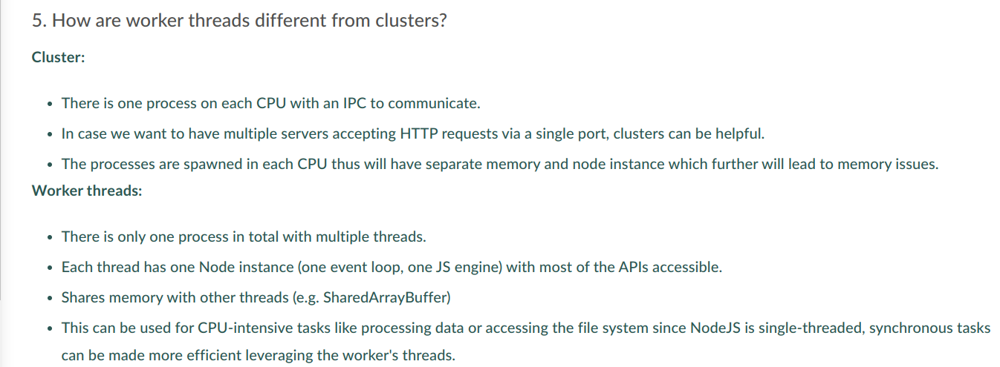

### General Questions

-  What is Microservices and Monolith?

### JavaScript Interview Questions

- What is Event Loop?
- What are callbacks?
- What is callback hell and how to prevent it?
- What are generators and how are they used to prevent callback hell?

### Node.js Interview Questions

- Why does Node.js use v8 engine?
- Is Node.js single threaded?
  - Yes, Node.js is single threaded but with the hwlp of libuv, async tasks are performed which makes it look like it is multi-thrteaded.
- What is callback hell and how to prevent it?
- How does Node.js handle child threads?
- How does Node.js support multi-processor platforms, and does it fully utilize all processor resources?
- What is typically the first argument passed to a Node.js callback handler?
  - An optional error object(err).
  - 
- What is Node REPL?
  - 
- What is the preferred method of resolving unhandled exceptions in Node.js?
  - 
- How does Node.js support multi-processor platforms, and does it fully utilize all processor resources?
  - 
- What is the difference between process.nextTick() and setImmediate()?
- What is the difference between cluster and worker_threads in Node.js?
- What is the purpose of the eventEmitter class?
- What is event-driven architecture in Node.js?
- What is streaming in Node.js?
- What are event emitters in Node.js?
- What are buffers in Node.js?
- How to use middlewares in Express.js and Node.js?
- 
- 
- 
- 
- How does Node.js handle concurrency?
  - The main loop is single threaded and all the async operations are handled by libuv.
- 
- 
- 
- What is the default scope of Node.js application?
  - Local scope
- What is meant by control flow in Node.js?
  - It is the sequence in which the statements and functions are executed.
- Explain the concept of stub in Node.js?
- How do you enhance Node.js performance through clustering in Node.js?
- What are the timer features of Node.js? (setTimeout and clearTimeout, setInterval and clearInterval, setImmediate and clearImmediate, nextTick)
- What is child process spawn, exec, fork in Node.js?
- What is range assert pattern in Node.js?
- Why clusters are different from worker sets in Node.js?
- What is the difference between readFile and createReadStream in Node.js?
- What is reactor pattern is Node.js?
- What is the difference between event emitters and Publish/Subscribe design pattern?
- What are promises in Node.js?
  - A promise is a JavaScript object which is used to handle all the asynchronous data operations. While developing an application you may encounter that you are using a lot of nested callback functions which causes a problem of callback hell. Promises solve this problem of callback hell.
- 
- 
- 
- 
- 
- 
- 
- 
- What is CORS and how do you handle it in Node.js?
  - CORS (Cross-Origin Resource Sharing) restricts resource sharing across domains. It can be handled using the cors package.
- What are some commonly used timing features of Node.js?
  - setTimeout/clearTimeout – This is used to implement delays in code execution.
  - setInterval/clearInterval – This is used to run a code block multiple times.
  - setImmediate/clearImmediate – Any function passed as the setImmediate() argument is a callback that's executed in the next iteration of the event loop.
  - process.nextTick – Both setImmediate and process.nextTick appear to be doing the same thing; however, you may prefer one over the other depending on your callback’s urgency. 
- What are the advantages of using promises instead of callbacks?
  - The main advantage of using promise is you get an object to decide the action that needs to be taken after the async task completes. This gives more manageable code and avoids callback hell.
- For Node.js, why Google uses V8 engine?
  - Well, are there any other options available? Yes, of course, we have Spidermonkey from Firefox, Chakra from Edge but Google’s v8 is the most evolved(since it’s open-source so there’s a huge community helping in developing features and fixing bugs) and fastest(since it’s written in c++) we got till now as a JavaScript and WebAssembly engine. And it is portable to almost every machine known.

### Express.js Interview Questions

- What is the difference between Express.js and Nest.js?
- Why should we separate express app and the server?
  - 
- What is Dependency Injection?
- What is the difference between Websockets and RESTful APIs?
- What is GraphQL?
- What is middleware chaining in Express.js?

### Databases Interview Questions

- What is the difference between MongoDB and PostgreSQL?